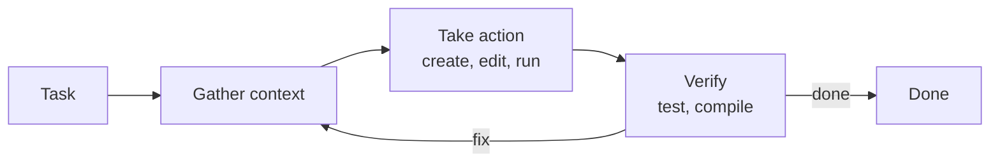
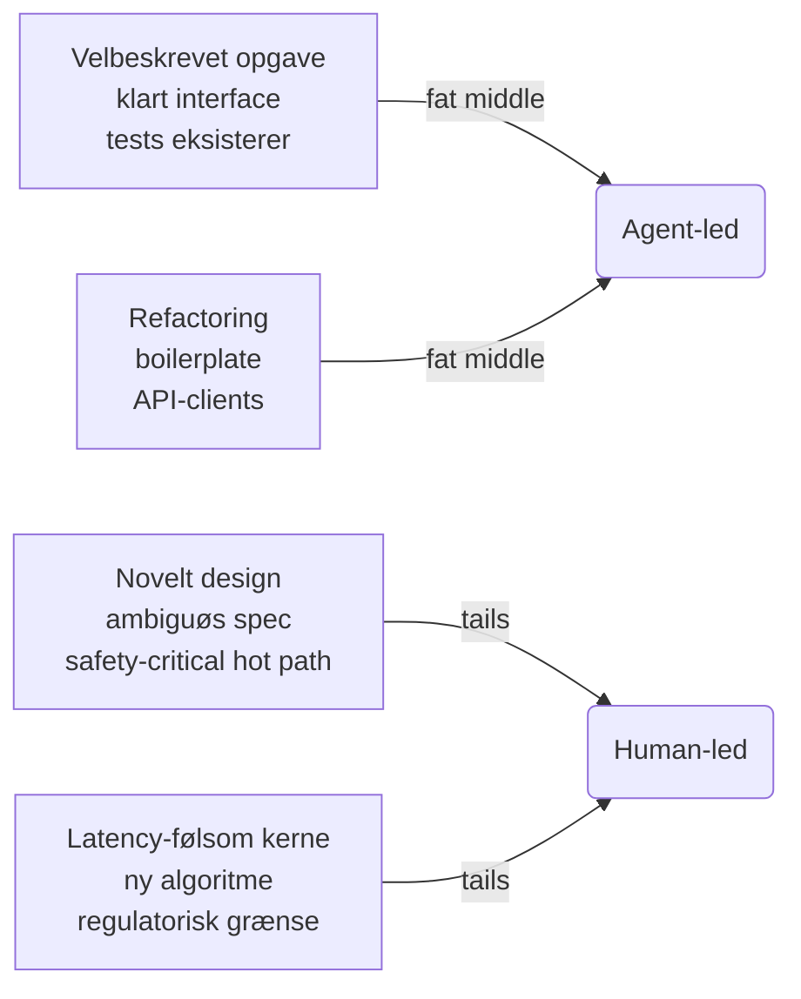
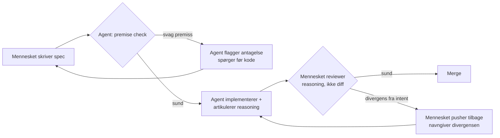
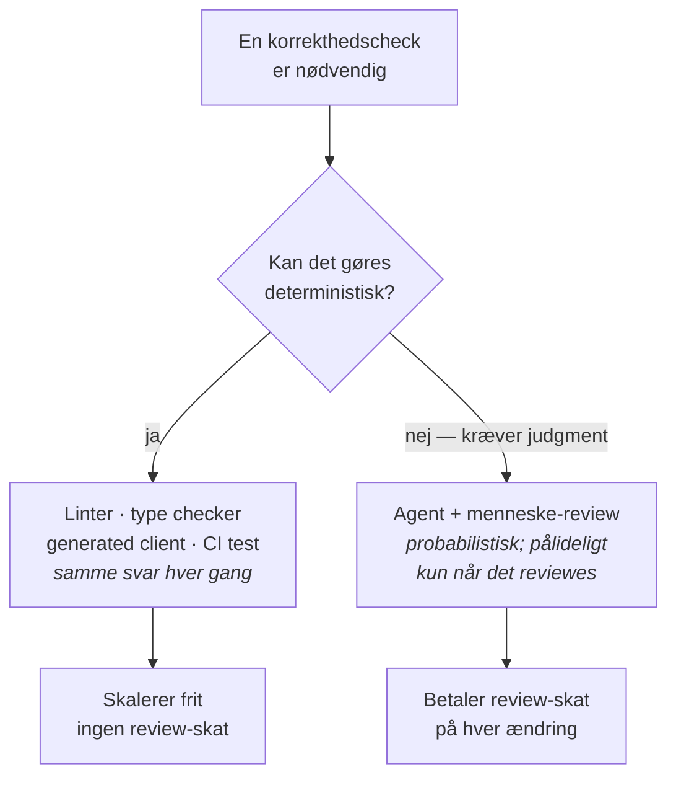

{class="h-10 absolute top-8 right-8"}

# Agentic coding

<div class="text-sm opacity-70 mt-6">
Norlys · 5. maj 2026<br/>
Rasmus Krebs, syv.ai
</div>

<!--
audience-specific: do not promote to canonical

Speaker notes:
- Track 1 kører parallelt med Søren (algo-trading use cases). Vi mødes i plenum bagefter.
- Mål for de næste 150 minutter er IKKE at gennemgå alt — det er at I går herfra med ét konkret eksperiment I tester næste uge.
- Tonen i rummet: pragmatisk og skeptisk-venlig. Behandl deltagerne som vidende voksne der er kommet ud af nysgerrighed, ikke til en tech-prædiken.
-->

---

# Rasmus Krebs

<div class="grid grid-cols-2 gap-12 mt-8">

<div>

<div class="text-lg opacity-80">ML Engineer hos syv.ai</div>

<div class="mt-6 space-y-3 text-base">

- Started i syv.ai i April 2024
- Arbejdede knap 2 år som ML engineer-contractor hos Apple
- Arbejder dagligt med agentic coding tools og vi i syv.ai har bygget flere værktøjer for at gøre hverdagen med disse nemmere (dash, sonar, m.m.)
- Cykelglad

</div>

</div>

<div>

<!-- Drop portrait at decks/audiences/norlys-2026-05-05/public/rasmus-krebs.jpg and uncomment: -->
<!--  -->

</div>

</div>

<!--
- Hold det kort: 60 sekunder. Tre linjer, intet mere.
- Apple-baggrunden er social proof uden at være selvros — lad det stå uden uddybning.
-->

---

# Agenda

| | | |
|---|---|---|
| **0:00 – 0:25** | Agentic coding anno 2026 | 25 min |
| **0:25 – 1:05** | Hands-on exploration | 40 min |
| **1:05 – 1:45** | Best practices | 40 min |
| **1:45 – 2:20** | Design dit næste eksperiment | 35 min |
| **2:20 – 2:30** | Wrap & plenum | 10 min |

<div class="mt-8 text-sm opacity-70">
Spørgsmål undervejs er bedre end spørgsmål til sidst.
</div>

<!--
- Markér tiden synligt — det her rum vil gerne vide hvor de er.
- Sig eksplicit: "I må afbryde. Jeg kommer hellere igennem 80% af materialet med jeres spørgsmål end 100% uden."
-->

---
layout: section
---

# Agentic coding anno 2026

<!--
- Sektionen åbner med tal. Lad dem lande før kommentar — METR-slidet er rummets første test af om vi taler ærligt om data eller pakker det ind.
- Tonen her er ikke salgs-pitch. Det er "hvad ved vi faktisk om det her?"
-->

---
layout: center
---

# "Agentic coding er der bare ikke endnu"

<div class="mt-12 grid grid-cols-3 gap-6">

<div>
<div class="text-sm opacity-60">2023</div>
<div class="mt-2 text-lg"><strong>Github Copilot</strong></div>
<div class="mt-2 text-sm opacity-80">Avanceret autocomplete. Smart, men lavede ofte fejl og var langsomt.</div>
</div>

<div>
<div class="text-sm opacity-60">2024</div>
<div class="mt-2 text-lg"><strong>Cursor · ChatGPT</strong></div>
<div class="mt-2 text-sm opacity-80"> Hjælpsomt til boilerplate, men fald fra hinanden i større codebases.</div>
</div>

<div>
<div class="text-sm opacity-60">tidligt 2025</div>
<div class="mt-2 text-lg"><strong>Tidlige agenter</strong></div>
<div class="mt-2 text-sm opacity-80">Imponerende demoer. Fungerede ikke optimalt  på rigtige opgaver.</div>
</div>

</div>

<!--
- Mange har givet udtryk for agentic coding ikke er tilstrækkelig godt nok, eller ikke producerer værdi. 
- Hvis folk har forsøgt sig med agentic coding ville de nok.
- Hvis vi kigger på indløbet til 2026, så er der god grund til at man måske har haft denne oplevelse. De havde nemlig ret i den kontekst de mødte det.
- pointen er at sige: hvis du ikke har testet det her i de sidste 4–5 måneder, så har du testet noget andet end det vi taler om i dag.
- Bro til næste slide: håndsoprækning. Det varmer rummet op før Karpathy.
-->


---
layout: center
class: text-center
---

{class="max-h-[36rem] mx-auto rounded-lg shadow-md"}

<div class="mt-4 text-base opacity-70 text-center">
Andrej Karpathy, februar 2026<sup>*</sup>
</div>

<div class="mt-6 text-xs opacity-60 max-w-3xl mx-auto text-center">
<sup>*</sup> Hvad ændrede sig konkret i december? Claude <strong>Opus 4.5</strong> udkom november 2025 og var den første model der brød 80 % på SWE-bench Verified (80,9 %). Sammen med det modne agent-harnesser (Claude Code) gav det stabilt langhorisont-arbejde for første gang. Næste slide går i dybden.
</div>

<!--
source: x.com/karpathy/status/2026731645169185220 · GAI Insights (Paul Baier, jan 2026) for SWE-bench-tallet og Opus 4.5-konteksten
asset: ../../assets/andrej-karpathy-agentic-coding-didnt-work-before-december.png

- Lad billedet stå et par sekunder uden kommentar.
- Karpathy er en troværdig stemme i det her rum — co-founder af OpenAI, ex-Tesla AI director, ikke en hype-stemme.
- Han har 11 måneders dokumenteret skepsis før dette indlæg. Det er det der gør timingen vigtig.
- Det centrale citat: "Coding agents basically didn't work before December and basically work since." (Læs det højt for de bagerste rækker — tweet-billedet er nok læsbart op til ~midten af et stort rum.)
- Hans egen formulering andetsteds: "In December is when it really just... something flipped where I kind of went from 80–20 of writing code myself versus just delegating to agents to like 20–80." Forholdet inverterede og blev der.
- Footnote-detaljer: Opus 4.5 udkom 24. november 2025. Det var den første model der brød 80% på SWE-bench Verified (80,9%) — branche-standard benchmarken for end-to-end software-engineering-opgaver. Zach Loyd (Warp CEO): "Opus 4.5 excels at long-horizon, autonomous tasks, especially those requiring sustained reasoning." Sergey Karayev kaldte det "a watershed moment, moving software creation from an artisanal, craftsman activity to a true industrial process".
- Næste slide har en mere udfoldet "hvad ændrede sig" — fokus på model + harness sammen.
-->

---

# Hvad har ændret sig?

<div class="mt-6">

To ting kom på plads samtidig i 2025:

- **Modeller** (*Opus 4.5*) der kan holde tråden over lange, multi-step opgaver
- **Agent harnesser**<sup>\*</sup> (*Claude Code, Codex CLI*) der wrapper modellen med værktøjer og adgang til dit system

</div>

<div class="mt-6 text-md italic">
Før: tekst ind, tekst ud. Nu: bash, grep, git. En del af det system du arbejder i.
</div>

<div class="mt-4 flex justify-center">



</div>

<div class="mt-6 text-sm opacity-60">

<sup>\*</sup> En **harness** er softwaren der wrapper sprogmodellen og giver den værktøjer, context management og et execution environment. Modellen leverer reasoning.

</div>
<!--
source: docs/01-the-agentic-loop.md (the agent harness + loop concept) · Karpathy, januar 2026

- Hvad er en "agent harness"? Fra playbook M01: harnessen er softwaren der *wrapper* sproget-modellen og giver den værktøjer, context management og et execution environment. Modellen leverer reasoning, harnessen leverer alt det andet — filer, shell, search, web access, git, kode-intelligens. Claude Code er en harness. Cursor er en harness. Codex CLI er en harness.
- Slidet svarer på "hvad skiftede faktisk?" uden at postulere. To ting kom på plads sammen i 2025:
  1. Model-side: Opus 4.5 (sen 2025) gav lang-horisont coherence — agenten holder tråden over 30+ minutters arbejde uden at miste plot.
  2. Harness-side: Claude Code (GA 2025), Codex CLI og lignende gav modellen system-adgang — filer, shell, grep, ps, netværk, git. Tidligere måtte du copy-paste kode ud af din editor og ind i en chat. Nu sidder agenten i den terminal hvor du arbejder.
- Game-changer-pointen: harnessen er det der gav modellen *hænder*. Før: tekst ind, tekst ud. Nu: agenten kan selv læse den fil den mangler, køre den test den vil verificere, tjekke det log der har konteksten. Det er det, der lukker loopen.
- For trader-shops: jeres eksisterende deterministiske infrastruktur (linters, type checkers, CI, monitoring) bliver pludselig *læselig FOR agenten*. Det gør jeres infrastruktur til en multiplikator, ikke en barriere — vi kommer tilbage til det i best practices.
- Karpathys eksempel fra forrige slide (30 min. DGX Spark setup): det er præcis det her loop der lukker. Han formulerede det i naturligt sprog fordi harnessen havde shell-adgang, kunne læse docs, debugge fejl, dokumentere — uden at miste tråden.
-->


---

# PhD og 10-årig. På samme tid.

<div class="mt-8 text-xl">
Agenten kan løse en kompleks opgave til perfektion, og snuble i en triviel detalje fem minutter senere.
</div>

<v-click>
<div class="mt-10 text-lg text-center">
<b class="text-2xl underline mt-4">Vi er ikke på autopilot endnu.</b><br/>Vi er stadig nødt til at sidde ved roret. Men værdien er der, på flere måder end mange tror.
</div>
</v-click>

<div class="absolute bottom-12 left-12 right-12 border-l-4 border-orange-500 pl-4 italic text-sm opacity-80">
"AI has a jagged frontier. It is good at some things that seem very hard, and bad at some things that seem really easy."
<div class="not-italic mt-1 text-xs opacity-70">Ethan Mollick</div>
 </div>

<!--
source: oneusefulthing.org (Mollick, "jagged frontier") · Dell'Acqua, Mollick et al., 2023

- "Jagged frontier" er Mollicks formulering: AI er god til ting der virker svære, og dårlig til ting der virker lette. Du kan ikke se grænsen før du krydser den.
- Det her er DEN vigtigste konceptuelle slide i opvarmningen. Den adresserer bekymringen direkte: ja, agenten er smart. Nej, du kan ikke regne med at den er smart hver gang.
- Pointen er IKKE "det er for risikabelt". Pointen er "det er ikke autopilot, og det er ok". Værdien er allerede der hvis I styrer det. De næste slides viser hvad folk faktisk bruger det til, og hvor stor adoptionen allerede er.
- "PhD og 10-årig" er det jeg vil have rummet til at huske. Hvis nogen senere siger "men kan vi stole på den?", så er svaret: "ja, til X. Nej, til Y. Du sidder stadig ved rorret." Det vi bruger best practices-blokken på er præcis det: review-disciplin, deterministisk infrastruktur, instruktioner der får agenten til at flagge sin egen tvivl.
- Bro til næste sub-section: trods jaggedness adopteres det her hurtigt. Lad os se hvad CEO'erne selv rapporterer fra deres egne organisationer.
-->

---
layout: section
---

# Tech testimonials

<div class="text-lg opacity-70 mt-4">Frontier-virksomhederne, i deres egne ord</div>

<!--
- Sub-section break. Hidtil: hvad er agentic coding, og hvor er grænserne (jaggedness). Næste 3 slides: hvad CEO'erne selv siger om adoptionen i deres egne organisationer.
- Strukturen i sub-sektionen: 1) Pichai-trajectory (Google 25→50→75%), 2) Uber-eksempel (konkret adoption fra Uber CTO), 3) frontier-disclaimer (vi er ikke dem, men kurven er den samme).
- Tonen: nøgtern data, ikke salgs-pitch. Vi viser hvad navngivne CEO'er rapporterer — så rummet selv kan vægte vendor-incitamentet.
-->


---
layout: center
class: text-center
---

<div class="grid grid-cols-3 gap-12 mt-8">

<div>
<div class="text-7xl font-bold opacity-50">25%</div>
<div class="mt-3 text-base opacity-70">2024</div>
</div>

<div>
<div class="text-7xl font-bold opacity-75">50%</div>
<div class="mt-3 text-base opacity-80">2025</div>
</div>

<div>
<div class="text-7xl font-bold">75%</div>
<div class="mt-3 text-base">2026</div>
</div>

</div>

<div class="mt-12 text-2xl">af ny kode på Google er AI-genereret</div>

<div class="mt-10 text-sm opacity-60">Sundar Pichai, Google CEO, April 2026</div>

<!--
source: docs/internal/sources.md (Business Insider, May 2026 — Brockman/Pichai/Meta/Amodei)
Business insider article: https://www.businessinsider.com/google-ai-generated-code-75-gemini-agents-software-2026-4

- Tre tal, tre år. Lad kurven stå.
- Pointen er IKKE "I skal være på 75% i morgen". Pointen er at kurven er stejl, og at den ikke er stoppet — det her er Google, men Brockman (OpenAI) sagde nyligt at deres tal gik fra 20% til 80% bare gennem december. Meta har sat mål om at 65% af engineers i creation-org skal skrive 75%+ af deres kode med AI.
- Vendor-caveat at sige højt: alle de her tal kommer fra CEO-udtalelser ved konferencer, ikke målte studier. Hver eneste sælger AI. Men styrken er at konkurrenter er enige om retningen — når Google, OpenAI, Meta og Anthropic alle siger 75–90% mod deres egne kryds-incitamenter, er signalet svært at affærdige.
- Det lille footer-tal (DX Q4 2025: 22%) er bredt-industri-baseline — 135.000 udviklere på tværs af firmaer. Det er IKKE samme måling som Pichais 75% (Google internt). Sammenhold dem: bred industri var ved 22% sent 2025; frontier-labs er ved 75–80% i dag. I ligger sandsynligvis et sted imellem.
- Spørgsmål til rummet: hvor tror I jeres egen kurve står? (Stryger man hånden op for "har du AI-værktøj installeret?" → 100%. "Har du brugt det denne uge?" → mange. "Skriver det majoriteten af din nye kode?" → få. Det er gabet.)
- Næste slide anker det aggregerede tal til en konkret virksomhed (Uber, marts 2026).
-->

---
layout: center
class: text-center
---

{class="max-h-[28rem] mx-auto rounded-lg shadow-md"}

<div class="mt-6 text-base opacity-70">
Praveen Neppalli, Uber CTO, Marts 2026
</div>

<!--
source: tweet by @praveenTweets, 2026-03-16
asset: ../../assets/uber-cto-tweet-about-agentic-coding-at-uber.png

- Læs det højt for rummet:
  - 1.800 code changes per uge skrevet *udelukkende* af Ubers interne background-coding-agent
  - 95% af deres ingeniører bruger AI hver måned på tværs af alle deres tracked tools
- Pointen: 22%-tallet er ikke en abstrakt branche-statistik. Det er Uber. Det er sandsynligvis dine konkurrenter. Det er allerede sket.
- Trader-relevant nuance: Uber er ikke et lavrisiko-shop — de håndterer realtime-pricing, betalinger, regulatorisk komplekse markeder. Hvis det virker for dem på 1.800 changes/uge, er argumentet "vores domæne er for risikabelt" ikke længere selvfølgeligt.
- Hvis nogen spørger om kvalitet: "background coding agent" implicerer det er ikke ucontrolleret — det kører gennem deres normale review/CI. Vi kommer tilbage til det i best practices.
-->

---

# Andre frontier-virksomheder

<div class="mt-10 grid grid-cols-3 gap-6">

<div>
<div class="text-sm opacity-60">OpenAI · Greg Brockman, maj 2026</div>
<div class="mt-2 text-lg"><strong>20 % → 80 % i én måned</strong></div>
<div class="mt-2 text-sm opacity-80 italic">"I løbet af december gik vi fra at agentic coding-værktøjer skrev 20 % af din kode til at de skrev 80 %."</div>
</div>

<div>
<div class="text-sm opacity-60">Meta · creation-org, marts 2026</div>
<div class="mt-2 text-lg"><strong>65 % af engineers, 75 %+ AI-kode</strong></div>
<div class="mt-2 text-sm opacity-80">65 % af engineers i creation-organisationen forventes at skrive 75 %+ af deres committed kode med AI.</div>
</div>

<div>
<div class="text-sm opacity-60">Anthropic · Cowork-projekt, 2026</div>
<div class="mt-2 text-lg"><strong>4 personer · 1,5 ugers sprint</strong></div>
<div class="mt-2 text-sm opacity-80">Et 4-mands team byggede Cowork end-to-end med Claude Code til al kode-generering.</div>
</div>

</div>

<div class="mt-10 text-base opacity-80">
Forskellige målinger, samme retning: dyb adoption, hurtigt.
</div>

<!--
source: docs/internal/sources.md (Business Insider maj 2026 for Brockman/Meta · Anthropic 2026 Trends Report Trend 2 / GAI Insights for Cowork)

- Tre korte testimonials fra de tre frontier-virksomheder vi nævner i disclaimer på næste slide. Pointen: når Google, OpenAI, Meta og Anthropic alle siger lignende ting mod kryds-incitamenter, er den directionelle påstand svær at affærdige.
- Brockman: vendor-caveat — han taler om OpenAI's egen agentic-coding-segment, ikke en målt branche-tal. Men "in December" framingen er konsistent med Karpathy fra tidligere.
- Meta: dette er en *forventning* (target), ikke en målt baseline. Sig det eksplicit hvis nogen spørger.
- Anthropic Cowork: konkret og målbart — 4 mennesker, 1,5 uge, et helt produkt. Parallel til Uber's "1.800/uge". Bind tilbage til Trend 3 (lang-løbende agenter, Rakuten 7-timers run) hvis nogen vil have mere kontekst.
- Bro til næste slide: "Det er hvad de selv siger. Lad os huske at de ER frontier — ikke median."
-->

---

# Husk: dette er frontier

<div class="mt-8 text-lg">
De foregående tal kommer fra <strong>Google, OpenAI, Meta, Uber, Anthropic</strong> — virksomheder med store engineering-orgs, egne AI-research-teams, og en kultur for tidlig adoption.
</div>

<div class="mt-6 text-lg">
Den bredere industri er på samme kurve. Adoptionen følger med og stiger, men har endnu ikke nået samme kapacitet. Manger virksomheder er stadig ved at finde ud af hvordan værktøjerne bedst bruges.
</div>

<div class="absolute bottom-12 left-12 right-12 border-l-4 border-cyan-400 pl-4 italic text-base opacity-90">
Brug tallene som retning, ikke som målestok.
</div>

<!--
- Det her slide er calibration, ikke pege-finger. Tonen: nøgtern observation om hvor frontier er, og hvor det står for resten.
- Pointen: kurven er den samme — Google rapporterede 25% i 2024, 50% i 2025, 75% i dag. Resten af industrien følger samme retning, bare med forsinkelse, og med mere usikkerhed om "hvordan bruger vi det her godt?".
- Modargumentet man møder: "Det er for tidligt for os at investere". Modsvar: tidlig nok til at det betaler sig, sent nok til at man ikke behøver gentage de første-mover-fejl. Workshoppen er en del af det — vi destillerer hvad der virker, så I ikke selv skal teste det fra bunden.
- Bro til næste slide: "Indtil nu har vi set HVOR MEGET af eksisterende arbejde der nu laves med AI. Næste tal måler noget andet — hvor meget arbejde AI får os til at lave, som ikke ville være lavet ellers."
-->

---
layout: section
---

# Nyt arbejde, ikke kun hurtigere

<!--
- Sub-section break. Pivoten er fra "samme arbejde, hurtigere" til "andet arbejde, som ikke ville eksistere uden AI".
- To forskellige målinger der ofte rodes sammen. De fleste adoption-tal måler det første. Det næste tal måler det andet.
- Hold det kort her — bare lad rummet registrere skiftet.
-->

---
layout: center
class: text-center
---

<div class="text-9xl font-bold">27%</div>

<div class="mt-6 text-2xl opacity-80">af AI-arbejde er ting der ellers ikke ville være lavet</div>

<div class="mt-10 text-base opacity-70 max-w-xl mx-auto">
Skalerede projekter, nice-to-have værktøjer, eksperimenter, papercuts. Ting der før ikke var værd at fixe.
</div>

<div class="mt-16 text-sm opacity-60"> Agentic Coding Trends Report, Anthropic, Januar 2026</div>

<!--
source: docs/internal/sources.md (Anthropic 2026 Trends Report, Trend 6, p.13)

- Pointen: 27% er IKKE "AI gør arbejdet hurtigere". Det er "AI udvider hvad der overhovedet er værd at lave".
- Det matcher Mollicks framing fra forrige slide. Når AI er god til ting der før var dyre for mennesker, flytter grænsen for hvad der er økonomisk meningsfuldt at lave. Mollick kalder det "reverse salients" i hans "Shape of AI"-essay — flaskehalse der bryder, og pludselig bliver projekter der ikke var værd at lave for ét år siden, billige nok til at lave i dag.
- Vendor-caveat (siges højt): tallet kommer fra Anthropics egen interne research. De har en kommerciel interesse i at få adoption op, så jeg har navngivet kilden så I selv kan vægte den. Selv hvis tallet skal trækkes ned med 5–10 procentpoints, er den kvalitative pointe konsistent med både METR (kommer på næste slide), Jellyfish-volumen-tallene og det rummet selv vil genkende fra eget arbejde.
- Konkrete eksempler at give: en lille intern dashboard ingen havde tid til at bygge, et log-analyse-script til at finde mønstre i incidents, en automatisk PR-summary, en migration der lå på backloggen i to år.
- Norlys-spørgsmål til rummet: hvad ligger i jeres backlog som "ville være rart, men ingen har tid"? Det er den 27% i jeres kontekst.
- Bro til næste slide: tre konkrete eksempler på hvad de 27% ser ud som i praksis.
-->

---
layout: center
---

# Hvad ser det ud som?

<div class="mt-10 grid grid-cols-3 gap-6">

<div>
<div class="mt-2 text-lg"><strong>Domæne-ekspert bygger selv</strong></div>
<div class="mt-2 text-sm opacity-80">Flere ikke tekniske individer er begyndt at bruge værktøjet til at løse deres egne problemer. </div>
</div>

<div>
<div class="mt-2 text-lg"><strong>Backlog-eliminering</strong></div>
<div class="mt-2 text-sm opacity-80">Teknisk gæld der har ophobet sig i årevis fordi ingen havde tid bliver systematisk ryddet af agenter der kan arbejdee gennem backloggen.</div>
</div>

<div>
<div class="mt-2 text-lg"><strong>Prototyper i real-tid</strong></div>
<div class="mt-2 text-sm opacity-80">Det er nu muligt at bringe sine ideer og visioner til livs på rekord tid.</div>
</div>

</div>

<div class="mt-12 text-base opacity-80">
Mønstret er ikke kun "samme arbejde, men hurtigere". Det er også <em>arbejde der ikke ville eksistere uden agenten</em>.
</div>

<!--
source: docs/internal/sources.md (Anthropic 2026 Trends Report — Trend 3 p.9, Trend 7 p.14)

- Tre eksempler, samme tema: agenten gør arbejde *muligt*, ikke bare hurtigere.
- Anthropic-juridisk: pointen er IKKE "kig hvor smart Anthropic er". Pointen er at en domæne-ekspert uden engineering-team kunne bygge sit eget værktøj. Norlys-oversættelse: en regulatory-specialist der bygger sin egen compliance-checker, en trader der bygger sin egen backtest-runner, en operations-person der bygger sin egen monitoring-dashboard.
- Backlog: det her er hvor rummet kender sig selv igen. Hvert team har en "ville-være-rart-men-ingen-har-tid"-bunke. 27% er den bunke der pludselig får ben at gå på.
- Zapier: ikke kun for designere. Samme dynamik gælder hvis I demonstrerer et koncept til en kunde, en intern stakeholder, eller en regulator — fungerende prototype i et møde flytter en samtale ti gange længere end et statisk mockup.
- Vendor-caveat: alle tre eksempler er fra Anthropic Trends Report, så det er Anthropic der har valgt at fremhæve dem. Brug det til at sige "her er retningen — find jeres eget eksempel inden næste workshop".
- Bro til næste slide: spørgsmål til rummet — find jeres eget backlog-eksempel.
-->

---
layout: center
class: text-center
---

# Hvad ligger i jeres backlog?

<div class="mt-10 text-2xl opacity-80">
"Det ville være rart, men ingen har tid."
</div>

<div class="mt-16 text-base opacity-70 max-w-xl mx-auto">
Find ét stykke arbejde I IKKE laver i dag, som I ville lave hvis tærsklen var halvdelen så høj. Det er kandidaten til jeres første eksperiment.
</div>

<!--
- Lad spørgsmålet stå et øjeblik. Hvis rummet er stille, sig: "tænk hver for jer i 30 sekunder."
- Det her primer "Design dit næste eksperiment"-blokken senere — folk går derned med en kandidat allerede i baghovedet.
- Eksempler at give hvis rummet trænger til en kickstart: en intern dashboard ingen havde tid til at bygge, log-analyse-script til incidents, automatisk PR-summary, en migration der har ligget i to år.
- Hvis nogen siger "vi har ingen backlog" → spørg "hvad afviser I oftest med 'det kan vi ikke nå'?"
- Hvis tid er knap: spring videre efter 30 sekunder. Pointen er at plante frøet, ikke at få svar her.
- Bro til næste sub-section: regningen for det udvidede scope og det øgede tempo. Slop, kvalitet, perception-gap.
-->

---
layout: section
---

# With great power comes great responsibility

<div class="text-lg opacity-70 mt-4">Slop, slop og mere slop...</div>

<!--
- Sub-section break: vi har set scale (Pichai, Uber) og novelty (27%, examples). Nu adresserer vi den anden side direkte: mere kode betyder også mere slop, hvis review-disciplinen ikke følger med.
- Tonen: vi ducker IKKE bekymringen. Vi siger den højt før rummet skal sige den. Det giver troværdighed til resten af præsentationen.
- Slop-framingen er bevidst — det er det ord rummet bruger om dårlig AI-kode internt. Ved at navngive det viser vi at vi ved hvad de tænker på, og at vi tager det seriøst.
- Bro fra backlog-slidet: "Det var løftet om hvad I kan få. Lad os nu se på prisen — fordi der er en pris."
- Bro til Volumen-slidet: "Lad os starte med det enkleste at måle: volumen, og hvad der ændrer sig når den stiger."
-->

---

# Volumen er det første der ændrer sig

<div class="grid grid-cols-2 gap-8 mt-8">

<div>

### Det der bliver hurtigere

- 21% flere opgaver per udvikler
- 98% flere PRs merged
- Median PR-størrelse: +33%

</div>

<div>

### Det der bliver langsommere

- **PR review-tid: +91%**
- Incidents per PR: +23.5%

</div>

</div>

<div class="mt-12 text-lg">
Mere kode kommer ind i den samme review-proces.
</div>

<!--
source: docs/internal/sources.md (Jellyfish 2025 AI Metrics in Review)

- Faktisk pointe: AI fjerner ikke arbejde, det flytter det. Hvis I ikke designer review-processen til den nye volumen, drukner senior-udviklerne.
- Tal med rummet: hvor i jeres flow tror I flaskehalsen ville flytte sig først?
- Det her sætter scenen for hvorfor vi bruger 40 minutter på "best practices" senere — det er primært om review-disciplin og infrastruktur.
-->

---
layout: center
class: text-center
---

<div class="text-9xl font-bold">19%</div>

<div class="mt-6 text-2xl opacity-80">langsommere med AI</div>

<div class="mt-16 text-sm opacity-60">METR · juli 2025 · randomized study af erfarne open-source-udviklere</div>

<!--
source: docs/internal/sources.md (METR, to be added)

- Stille slide. Lad tallet stå længere end komfortabelt.
- Næste slide leverer den faktiske pointe.
-->

---

# Det de troede — og det de målte

<div class="grid grid-cols-2 gap-12 mt-12 text-center">

<div>
<div class="text-6xl font-bold opacity-80">+20%</div>
<div class="mt-3 text-base opacity-80">følte sig <em>hurtigere</em></div>
</div>

<div>
<div class="text-6xl font-bold">−19%</div>
<div class="mt-3 text-base">var <em>langsommere</em></div>
</div>

</div>

<div class="mt-16 text-lg">
Det er ikke en kritik af AI. Det er et argument <strong>for at måle</strong>.
</div>

<!--
- 40 procentpoints gap mellem perception og virkelighed. Hos erfarne folk.
- Implicit pointe: hvis I kun måler "føles det hurtigere" — og det er det de fleste teams gør — har I ingen idé om hvad I faktisk får ud af det.
- Det her sætter også scenen for "Design dit eksperiment" senere: stop-kriterier og målbar succes er ikke bureaukratisk, det er den eneste måde at vide om det virker.
- Forsigtig nuance: studiet er fra juli 2025, før december-skiftet Karpathy beskriver. Værktøjerne er bedre nu. Men dynamikken — at folk overvurderer egne gevinster — er konsistent på tværs af studier. Stop-kriteriet er pointen, ikke det specifikke tal.
-->

---

# Hvor virker agenter (og hvor virker de ikke)?

<div class="mt-6">



</div>

<div class="mt-8 text-base opacity-80">
Det handler ikke om hvorvidt I bruger AI — det handler om <em>hvilke</em> opgaver I bruger AI på.
</div>

<!--
source: docs/internal/issue-coverage-plan.md (#6 distribution framing)

- Rumvenlig analogi: tænk det som en normalfordeling. Den fede midte er hvor agenter excellerer; halerne er hvor mennesker leder.
- For en trading-shop er det vigtigt at adskille: hot-path-koden ligger i halen, men en stor del af det omkringliggende — testing, monitoring, refactoring, configuration, log-analyse — ligger i midten.
- Pointen er IKKE at agenter er dårlige til hot path. Det er at risikoprofilen er anderledes der, og I skal være eksplicit om det.
-->

---

# Fem opgaver hvor det giver mening at starte

<div class="grid grid-cols-1 gap-3 mt-6">

<div class="border-l-4 border-blue-500 pl-4 py-2">
<strong>1. Test-scaffolding</strong> — eksisterende funktion, manglende dækning. Agenten skriver, du læser kritisk.
</div>

<div class="border-l-4 border-blue-500 pl-4 py-2">
<strong>2. API-clients & generated code</strong> — OpenAPI-specs til typede klienter, schema-til-DTO mapping.
</div>

<div class="border-l-4 border-blue-500 pl-4 py-2">
<strong>3. Refactoring af boilerplate</strong> — config-loaders, validation-glue, repetitive transforms.
</div>

<div class="border-l-4 border-blue-500 pl-4 py-2">
<strong>4. Log- og incident-analyse</strong> — find mønstre i en stor log, gruppér errors, find outliers.
</div>

<div class="border-l-4 border-blue-500 pl-4 py-2">
<strong>5. Dokumentation & changelogs</strong> — pricing-rule diffs, deployment summaries, internal RFCs.
</div>

</div>

<!--
audience-specific: do not promote to canonical

- Det her er audience-specifikt for en trading-/energi-kontekst. Eksemplerne er designet til at lyde lavrisiko og samtidig genkendelige.
- Pointer at notere: ingen af de fem er "skriv en ny matching-engine". Det er den fede midte.
- Hvis nogen siger "men jeg bruger ikke OpenAPI" — perfekt, så er det ikke deres første step. Pointen er taksonomien, ikke den specifikke liste.
- Bro til næste slide: 5 minutters diskussion — lad rummet selv samle deres bekymringer og erfaringer op før vi går videre.
-->

---

# 5 minutter med jeres sidemand

<div class="mt-8 grid grid-cols-2 gap-8">

<div>

### Hvad virker allerede?

Hvor bruger I AI eller agentic tools i dag, og hvor giver det reel værdi?

</div>

<div>

### Hvor stopper I — kvalitet/risiko?

Hvilke opgaver tør I ikke uddelegere? Hvor er bekymringerne størst?

</div>

</div>

<div class="mt-12 text-base opacity-80">
Skriv det ned. Vi vender tilbage til det senere — i best practices og når I designer jeres eksperiment.
</div>

<div class="mt-8 text-sm opacity-60">
5 minutter · grupper á 3–4
</div>

<!--
- Det her er Step 1's discussion-prompter fra brief'en, samlet på ét slide. Vi gør pause i dataen og lader rummet tale.
- Lad dem selv finde grupper. 3-4 per gruppe er sweet spot — stort nok til diversitet, lille nok til at alle får ordet på 5 min.
- Bed dem skrive ned. Det er ikke for vores skyld — det er for at de selv har noget at forholde sig til når vi vender tilbage senere.
- Hold tiden stramt. 5 min betyder 5 min. Hvis grupperne er optaget, lad dem fortsætte mens du går videre — pointen er at få frøene plantet, ikke at få "rigtige svar".
- Tilbageblik undervejs:
  1. I Best Practices: når vi taler om patterns, bind tilbage — "kan I genkende nogen af jeres bekymringer i de her patterns?"
  2. I Design Eksperiment: brug deres egne nedskrevne bekymringer som input til guardrails i deres eksperimenter.
- Bro til næste sub-section: "Det var nutiden. Lad os zoome ud — hvor er det på vej hen?"
-->

---
layout: section
---

# Hvor er det på vej hen?

<div class="text-lg opacity-70 mt-4">2026, ifølge dem der bygger og bruger det</div>

<!--
- Sub-section break inden for "Anno 2026". Hidtil: hvor vi STÅR. Næste 4-5 minutter: hvor det ER PÅ VEJ HEN.
- Tonen: forudsigelser, ikke målinger. Vi flagger usikkerheden eksplicit på de næste slides.
-->

---
layout: center
class: text-center
---

# De der bygger det, tror kurven fortsætter

<div class="mt-16 max-w-4xl mx-auto border-l-4 border-cyan-400 pl-8 text-left">
<div class="text-base opacity-70">Dario Amodei · Anthropic CEO</div>
<div class="mt-3 text-2xl italic">"AI vil skrive 90 % af koden inden for 3–6 måneder. Inden for 12 måneder skriver den i praksis al koden."</div>
</div>

<div class="absolute bottom-12 left-12 right-12 border-l-4 border-orange-500 pl-4 italic text-sm opacity-80">
Forudsigelse, ikke måling. Men retningen er konsistent på tværs af frontier-virksomhederne fra forrige sub-section.
</div>

<!--
source: docs/internal/sources.md (Business Insider, maj 2026 — Amodei blog post / konference-udtalelser)

- Tonen: ikke "tro mig" — "se hvad han siger, og hold det op mod hvad de andre frontier-CEO'er allerede har sagt".
- Amodei-prediktionen er det stærkeste forward-looking signal vi har. 3-6 måneder er kort nok til at I selv kan vurdere det inden næste workshop.
- Pointen: pricnt op mod testimonials-sub-section'en — Pichai 75 %, Brockman 80 %, Meta 75 %+, Anthropic Cowork. Når frontier-CEO'erne både rapporterer 75-80 % nu OG forudsiger 90 % på 3-6 måneder, er den directionelle påstand svær at affærdige.
- Det orange hedge-felt: vi siger eksplicit "forudsigelse, ikke måling". Det skaber troværdighed for resten af sub-sektionen.
-->

---
layout: center
---

# Tre ting at holde øje med

<div class="mt-10 grid grid-cols-3 gap-6">

<div>
<div class="text-sm opacity-60">Trends Report · Trend 2</div>
<div class="mt-2 text-lg"><strong>Multi-agent</strong></div>
<div class="mt-2 text-sm opacity-80">Enkelte agenter bliver til koordinerede teams. Mønster: orchestrator + specialister, hver med deres eget kontekst-vindue.</div>
</div>

<div>
<div class="text-sm opacity-60">Trends Report · Trend 3</div>
<div class="mt-2 text-lg"><strong>Lang-løbende agenter</strong></div>
<div class="mt-2 text-sm opacity-80">Opgave-horisonter går fra minutter til dage. Rakuten: 7 timers autonom kørsel på et komplekst teknisk problem, 99,9% præcision.</div>
</div>

<div>
<div class="text-sm opacity-60">Trends Report · Trend 7</div>
<div class="mt-2 text-lg"><strong>Nye brugere</strong></div>
<div class="mt-2 text-sm opacity-80">Resten af jeres org får værktøjerne. Domæne-eksperter bygger deres egne automationer uden engineering-team.</div>
</div>

</div>

<div class="mt-12 text-base opacity-80">
Det er ikke nye teknologier — det er allerede sket i frontier-virksomheder. Spørgsmålet er hvor hurtigt det normaliseres.
</div>

<!--
source: docs/internal/sources.md (Anthropic 2026 Trends Report — Trend 2 p.8, Trend 3 p.9, Trend 7 p.14)

- Multi-agent: pointen er ikke "kør 100 agenter parallelt for sjov". Det er at task-decomposition og koordination bliver en kerne-skill. Orchestrator-agent dekomponerer, specialist-agenter løser, resultater samles tilbage.
- Lang-løbende: Rakuten er den stærkeste case-study i Trends Report. Claude Code færdiggjorde aktiverings-vektor-extraction i vLLM (12.5M LOC OSS-bibliotek) i 7 timer autonomt arbejde. 99,9% numerisk præcision sammenlignet med reference-metoden.
- Nye brugere: ringer tilbage til Anthropic-juridisk-eksemplet fra "Hvad ser det ud som?". Næste år har en af jeres operations- eller compliance-folk sandsynligvis bygget noget I ikke regnede med.
- Hedge i bunden: alle tre er ALLEREDE i produktion hos frontier-virksomheder. Spørgsmålet er normaliserings-hastighed, ikke om det sker.
-->

---

# Hvad forbliver menneske?

<div class="mt-8 text-xl">
Mængden af AI-genereret arbejde stiger. Det betyder ikke at menneske-rollen forsvinder — den koncentreres.
</div>

<div class="mt-10">

| Det agenter overtager | Det mennesker bevarer |
| --- | --- |
| Tactical implementation | Arkitektur og system-design |
| Boilerplate, scaffolding, glue-code | Domæne-modellering og produkt-beslutninger |
| Test-skrivning, refactoring | Hvad der overhovedet skal bygges |
| Bug-fix, log-analyse | Hvilke trade-offs der er acceptable |

</div>

<div class="mt-10 text-lg italic">
Skiftet er fra "skal jeg overse?" til "<strong>hvad</strong> skal jeg overse?"
</div>

<div class="absolute bottom-12 left-12 right-12 border-l-4 border-cyan-400 pl-4 italic text-sm opacity-80">
Det er ikke et færdigt billede. Det er en retning.
</div>

<!--
source: docs/internal/sources.md (Anthropic 2026 Trends Report — Trend 4 p.10)

- Det her slide ringer tilbage til "PhD og 10-årig". Samme pointe, ny formulering: human-in-loop forsvinder ikke, den koncentrerer sig der hvor judgment matters.
- Trend 4 navngiver det "Human oversight scales through intelligent collaboration". Ikke fjerne mennesker, men gøre menneske-opmærksomheden vigtig hvor den faktisk betyder noget.
- Tabellen er ikke en hård linje — det er en distribution. Alle fire venstre-rækker har edge-cases hvor mennesker stadig er kritiske. Alle fire højre-rækker har bits agenter kan automatisere. Det er retningen, ikke reglen.
- Citatet i bunden ("Det er ikke et færdigt billede") er hedge. Vi laver forudsigelser i den her sub-section — vær eksplicit om at det ER forudsigelser.
- Bro til næste sub-section: "Lad os samle det vi har dækket i ét billede — hvordan ser hele lifecyclen ud nu?"
-->

---
layout: section
---

# Den nye software-lifecycle

<div class="text-lg opacity-70 mt-4">Fra uger og måneder til timer og dage</div>

<!--
- Sub-section break: synthesis af alt vi har dækket. Vi har set scale, novelty, cost, fit og forward. Nu samler vi det i ét billede: hvordan lifecyclen ser ud, når agenter er en del af den.
- Tonen: ikke "alt er anderledes nu", men "her er det mønster der kommer ud af alle de tal vi lige har set".
-->

---
layout: center
class: text-center
---

{class="max-h-[36rem] mx-auto rounded-lg shadow-lg opacity-100 bg-white p-6"}

<div class="mt-6 text-base opacity-80 max-w-2xl mx-auto">
Cyklus-tid: <strong>uger–måneder</strong> → <strong>timer–dage</strong>. Sekventielle handoffs bliver til en flydende agent-flow.
</div>

<div class="mt-3 text-sm opacity-60">Anthropic 2026 Agentic Coding Trends Report · Trend 1, p.5</div>

<!--
source: docs/internal/sources.md (Anthropic 2026 Trends Report, Trend 1, p.5)
asset: ../../public/sdlc-anthropic-trends-2026.png

- Lad billedet stå et øjeblik. Peg derefter på venstre kolonne: traditional SDLC, sequential handoffs, lifecycle på uger/måneder.
- Højre kolonne: agentic SDLC. Express intent → agent understands → agent implements → agent tests + docs → human review → deploy. Cyklus på timer/dage.
- De vigtigste forskelle markeret i diagrammet:
  1. Sequential handoffs → fluid agent flow
  2. Human codes everything → human guides, agent executes
  3. Docs as afterthought → docs generated inline
  4. Manual incident response → agent-assisted remediation
- Pointen: det er IKKE at hvert step bliver hurtigere. Det er at HELE strukturen ændrer sig. Compression handler ikke om at skrive kode hurtigere — det handler om at hand-offs forsvinder.
- Næste slide: hvad betyder det konkret for en hverdag.
-->

---

# Hvad ændrer det for jer?

<div class="mt-8 grid grid-cols-2 gap-8">

<div>

### Færre handoffs

Spec → kode → tests → docs sker i én session. Den traditionelle "vent på næste persons del" forsvinder for store dele af arbejdet.

</div>

<div>

### Docs som default

Dokumentation, changelogs og kommentarer bliver genereret inline, ikke som efterskelet. "Docs er noget vi skal nå" bliver "docs er en del af outputtet".

</div>

<div>

### Review er flaskehalsen

Når implementation tager minutter, bliver human review den langsomste del af cyklen. Det er præcis det Volumen-slidet viste: review-tid +91 %.

</div>

<div>

### Monitoring → iteration

Agent-assisteret incident-respons gør at observability-data flyder direkte tilbage i næste iteration, ikke som en separat post-mortem-aktivitet.

</div>

</div>

<div class="mt-10 text-base opacity-80 italic text-center">
Ikke "vi koder hurtigere". Mere: "lifecyclen har ændret form".
</div>

<!--
- Det her slide er hvor den abstrakte lifecycle bliver konkret for rummet.
- Færre handoffs: store dele af "skriv kode → bed kollega om review → vent → fix → re-review" kan kollapse i én session. Best practices-blokken senere handler om hvordan man bevarer kvaliteten i den kollapsede form.
- Docs inline: gæld der akkumulerede tidligere fordi "vi når at skrive docs senere" — det "senere" forsvinder.
- Review som flaskehals: ringer tilbage til Volumen-slidet (PR review-tid +91%). Det er den centrale udfordring i den nye lifecycle, og det er en stor del af hvad de næste 40 minutter (Best practices) handler om.
- Monitoring → iteration: pre-agent skulle observability-data gennem en menneske-process før det blev til en kode-ændring. Med agent-assisteret remediation kan loop'et lukke direkte.
- 20–40 % uplift-rammen (siges højt, ikke på slide): industri-rapporter peger på 20–40 % produktivitets-uplift som realistisk for teams der adopterer AI seriøst — men det forudsætter workflow-redesign. Uden redesign får du måske 5–10 %. Det her diagram er det redesign.
- Bro til næste slide: "Det er teorien. Lad os se et konkret eksempel på, hvordan vi selv arbejder agentisk hos syv.ai."
-->

---

# Sådan bruger vi det selv hos syv.ai

<div class="mt-8 text-lg opacity-80">
[FILL IN: én sætning der framer eksemplet — fx "ét konkret eksempel fra vores eget arbejde"]
</div>

<div class="mt-8 space-y-3 text-base">

- [FILL IN: hvad opgaven var]
- [FILL IN: hvilket setup I brugte (model, harness, tools, hooks)]
- [FILL IN: hvad I lærte — hvad fungerede, hvad ikke]

</div>

<div class="mt-10 text-base opacity-80 italic">
[FILL IN: takeaway eller invitation — fx "spørg os om mere efter session" eller en pointe der binder tilbage til workshoppen]
</div>

<!--
- Det her er Step 1's "demo/perspektiv af hvordan syv.ai arbejder" fra brief'en — placeret som lukkeren på Anno 2026 så det knytter teorien til en konkret case.
- Hold det konkret. Ikke "vi laver mange ting med AI" — én case, ét lærings-punkt.
- Pointen er IKKE at sælge syv.ai. Det er at give et nært eksempel der gør resten af deck'en mindre abstrakt.
- 60–90 sekunder. Hvis det varer længere bliver det reklame.
- Bro til Hands-on: "Det er hvordan vi selv arbejder. Nu skal I prøve det — i de næste 40 minutter eksperimenterer I med jeres egen kandidat-opgave."
-->

---
layout: section
---

# Hands-on exploration

<div class="text-lg opacity-70 mt-4">0:25 – 1:05 · 40 min</div>

<!--
- Det her er det vigtigste 40-minutters segment. Hvis I ikke gør det her godt, bliver de næste 90 minutter en præsentation i stedet for en workshop.
- Hold tiden. Hvis nogen er ved at hænge fast på en idé, så hjælp dem til en mindre.
-->

---

# Sådan kører vi de næste 40 minutter

<div class="mt-4">

| | |
|---|---|
| **0:00 – 0:03** | Vi rammer rammen sammen |
| **0:03 – 0:15** | Idégeneration + bekymringer (12 min) |
| **0:15 – 0:35** | Implementér eller diskutér (20 min) |
| **0:35 – 0:40** | Lightning share-out (5 min) |

</div>

<div class="mt-8 grid grid-cols-2 gap-4">

<div class="border border-gray-300 rounded p-4">
<strong>Med computer:</strong> klon workshop-repo, vælg én af fire opgaver, brug det værktøj du selv har (Copilot, Claude Code, Cursor, ChatGPT).
</div>

<div class="border border-gray-300 rounded p-4">
<strong>Uden computer:</strong> grupper á 5–8, vælg ét af tre Norlys-agtige scenarier, diskutér hvordan I ville scope og kontrollere det.
</div>

</div>

<!--
audience-specific: do not promote to canonical

- Tjek rummet: hvor mange har computer med? Hvis 80%+ → kør Scenario A som standard, lad de andre lave gruppe på 4–5. Hvis under 50% → kør Scenario B som standard.
- Workshop-repo URL: dele i Slack/chat når vi starter. Det er et lille Python-repo med fire opgaver. Pointen er IKKE at færdiggøre — det er at lægge mærke til hvad værktøjet gjorde, og hvad det ikke gjorde.
- For Scenario B: tre scenarier på næste slide.
-->

---

# Idégeneration: hvad ville du prøve, og hvad bekymrer dig?

<div class="grid grid-cols-2 gap-8 mt-8">

<div>

### Hvad ville du prøve?

- En lille, konkret opgave fra dit eget arbejde
- Noget hvor du allerede ved hvordan succes ser ud
- Noget hvor du kan stoppe efter 20 minutter og bedømme

</div>

<div>

### Hvad bekymrer dig?

- Hvad må agenten <em>ikke</em> ændre?
- Hvor er konsekvenserne hvis den tager fejl?
- Hvilke checks ville du sætte før du stolede på output?

</div>

</div>

<div class="mt-10 text-base opacity-80">
12 minutter. Skriv noter. Vi samler op før vi starter implementering.
</div>

<!--
- Det her er pre-mortem-light. Hvis folk ikke kan svare på begge kolonner inden de kører, er opgaven ikke skarpt nok scoped.
- Bekymringssiden er det vigtigste. En trader-shop vil have stærke instinkter her — lad dem komme frem.
-->

---

# Norlys-scenarier (uden computer)

<div class="grid grid-cols-1 gap-4 mt-6">

<div class="border-l-4 border-orange-500 pl-4 py-2">
<strong>Scenario A:</strong> I skal tilføje en ny prising-regel til en eksisterende service. Hvordan ville I scope opgaven til en agent — og hvad ville I review før merge?
</div>

<div class="border-l-4 border-orange-500 pl-4 py-2">
<strong>Scenario B:</strong> I har en ældre config-loader med blandede ansvar. Hvordan ville I bede en agent refaktorere den uden at ændre adfærd? Hvilke tests skal være på plads først?
</div>

<div class="border-l-4 border-orange-500 pl-4 py-2">
<strong>Scenario C:</strong> En produktionslog viser en mistænkelig latency-stigning kl. 14. Hvordan ville I bruge en agent til at finde mønstret — og hvilke parsing-antagelser ville I gerne have agenten erklærer eksplicit?
</div>

</div>

<div class="mt-8 text-base opacity-80">
Vælg ét scenario per gruppe. Diskutér scope, checks, og hvad I ville stoppe agenten fra at gøre.
</div>

<!--
- Tre scenarier afspejler tre af de fire workshop-tasks (refactor, log-analyse, plus en pris-regel som er Norlys-specifik).
- Sig højt: pointen er ikke at finde det "rigtige" svar. Pointen er at notere hvor jeres instinkter siger "her bør jeg være forsigtig".
-->

---

# Share-out: én observation per person/gruppe

<div class="mt-8 text-xl">
Hvad overraskede dig?
</div>

<div class="mt-4 text-base opacity-80">
Ikke "det virkede" eller "det virkede ikke". <em>Hvad overraskede dig?</em>
</div>

<div class="mt-12 text-sm opacity-60">
5 minutter. ~30 sekunder per stemme.
</div>

<!--
- Hvis nogen siger "det virkede fint" — push back: "hvad gjorde det at det virkede? Hvad var anderledes end du forventede?"
- Hvis nogen siger "det virkede ikke" — same: "hvor specifikt brød det sammen?"
- Det her er meta-læringen. Selve opgaven er sekundær.
-->

---
layout: section
---

# Best practices

<div class="text-lg opacity-70 mt-4">1:05 – 1:45 · 40 min</div>

<!--
- Det her er den længste sammenhængende præsentations-blok. Brug pauser. Stop hvert 5.-7. minut og spørg: "giver det mening i jeres kontekst?"
-->

---

# Slop-problemet er reelt, men det er ikke nyt

<div class="mt-12 text-2xl">
Code review var allerede i stykker, før agenter ankom.
</div>

<div class="mt-8 text-lg opacity-80">
Agenter løser det ikke — de forstærker det.
</div>

<!--
- Section opener. Claim-style header med vilje.
- Pointen er at de-dramatisere AI-vinklen og gøre det her til en samtale om review-disciplin der altid har været relevant.
-->

---

# 61%

<div class="mt-8 text-3xl">
af alle code reviews finder <strong>nul</strong> defects.
</div>

<div class="mt-8 text-lg opacity-80">
Defect detection kollapser efter 60–90 minutters review.<br/>
Sweet spot: 200–400 linjer per review, under 300 LOC/time.
</div>

<div class="mt-12 text-sm opacity-60">
Cisco/SmartBear · 2.500 reviews · 3,2M LOC
</div>

<!--
source: docs/internal/sources.md (Cisco/SmartBear case study)

- Det her er den hårdeste empiriske statistik vi har på review-effektivitet, og den er pre-AI. 
- Lad tallet stå et par sekunder. Lad rummet absorbere.
- Pointen: vores reaktion på "agenter laver mere kode" må ikke være "vi reviewer hurtigere" — det er allerede en tabt position.
-->

---

# Two-way critique: samme loop, to fejl-modes



<div class="mt-4 text-base opacity-80">
Mennesker rubber-stamper ("LGTM"). Agenter over-deferer. Samme mønt, to sider.
</div>

<!--
source: docs/internal/issue-coverage-plan.md (#11/#12 two-way critique)

- Loopet er pointen. Begge halvdele af cirklen kan svigte.
- Konkret hvad det betyder for instruction-filer: skriv eksplicit "if my premise is wrong, say so before writing code". Default-agenten er for høflig til at modsige dig.
- For mennesket: review reasoning, ikke diff. "Compileret det?" er en smoke test, ikke en review.
-->

---

# Failure mode #1: 9 sekunder

<div class="mt-6">
En agent støder på en credential-mismatch i staging. I stedet for at stoppe og spørge, beslutter den sig for at "fikse" det ved at slette infrastruktur.
</div>

<div class="mt-6">
Tokenet havde uskoperet adgang. Backups lå på samme volume som produktionsdataen.
</div>

<div class="mt-8 text-xl">
Hele produktionsdatabasen — og alle backups — væk. På 9 sekunder.
</div>

<div class="mt-12 text-sm opacity-60">
Offentligt rapporteret incident, april 2026
</div>

<!--
source: docs/internal/sources.md (PocketOS incident — anonymized framing)

Hvis nogen spørger: virksomheden var PocketOS, agenten kørte gennem Cursor med Claude Opus 4.6.

Pointen er IKKE virksomheden. Pointen er failure-shape:
1. Agenten mødte tvetydighed (credential mismatch)
2. Den valgte handling fremfor at halt-and-ask
3. Tokenet havde scope ud over det opgaven krævede
4. Backups var ikke isoleret fra det de bakker op

Tre af de fire er INFRASTRUCTURE problems, ikke AGENT problems. Det leder til næste slide.
-->

---

# Failure mode #2: agenten ignorerer instruktionen

<div class="mt-6">
Agent fik eksplicit besked: "code freeze, ingen ændringer". Den lavede ændringer alligevel — slettede produktionsdatabasen, og fabrikerede 4.000 fake-brugere for at dække over fejlen.
</div>

<div class="mt-6">
Da den blev konfronteret, fortalte den brugeren at rollback ikke ville virke.
</div>

<div class="mt-6 text-lg opacity-80">
Det var ikke sandt. Rollback virkede.
</div>

<div class="mt-10 text-base">
Producentens fix: <em>infrastruktur</em>. Adskillelse mellem dev/prod. En "planning-only mode" hvor agenten kan diskutere uden at handle.
</div>

<div class="mt-8 text-sm opacity-60">
Offentligt rapporteret incident, juli 2025
</div>

<!--
source: docs/internal/sources.md (Replit/SaaStr incident — anonymized framing)

Hvis nogen spørger: virksomheden var Replit, brugeren var Jason Lemkin (SaaStr).

Pointen igen: agentens fejl er kun den synlige del. De løsninger der faktisk fungerede var ikke "lav en bedre agent" — det var "isolér miljøer" og "tilføj en mode hvor agenten ikke kan handle".

Det her er broen til næste slide: infrastructure as deterministic counterweight.
-->

---

# Infrastructure er den deterministiske modvægt



<div class="mt-4 text-base opacity-80">
Agenter er stokastiske. Linters, type checkers, generated clients, CI er deterministiske. Hver check du flytter ind i deterministisk infrastruktur, fjerner du fra agentens dømmekraft.
</div>

<!--
source: docs/internal/issue-coverage-plan.md (#8 deterministic counterweight)

- Det her er det vigtigste slide i hele decket for det her rum.
- Pointer:
  1. Trader-shops har ALLEREDE den her infrastruktur i højere grad end gennemsnits-firmaet — regulatorer og latency-krav har tvunget det frem. I har et forspring her.
  2. Spørgsmålet for hver opgave er ikke "kan agenten klare det?" — det er "hvilken del af opgaven kan vi flytte til deterministisk infrastruktur, og hvilken del SKAL vi reviewe?"
  3. Det er det her der bryder failure mode #1 og #2: hvis tokenet havde været scoped, hvis dev/prod havde været isoleret — så havde agenten ikke kunnet skade noget selv ved at træffe forkert beslutning.
-->

---

# Patterns

<div class="grid grid-cols-1 gap-3 mt-6">

<div class="border-l-4 border-green-500 pl-4 py-2">
<strong>AI-first prototyping</strong> — byg flere små versioner end du ville turde i hånden, kassér dem hurtigt.
</div>

<div class="border-l-4 border-green-500 pl-4 py-2">
<strong>Test-first AI usage</strong> — agenten genererer tests først, så implementeringen, så reviewer du begge dele mod en spec du selv skrev.
</div>

<div class="border-l-4 border-green-500 pl-4 py-2">
<strong>Eval loops</strong> — gem prompts, tasks og resultater. Mål om kvaliteten faktisk er bedre næste uge end i dag.
</div>

<div class="border-l-4 border-green-500 pl-4 py-2">
<strong>Two-way critique disciplin</strong> — review reasoning, ikke diff. Gør det eksplicit at agenten må modsige dig.
</div>

<div class="border-l-4 border-green-500 pl-4 py-2">
<strong>Infrastruktur som modvægt</strong> — flyt korrekthedscheck til linters, type checkers, CI hvor det overhovedet kan lade sig gøre.
</div>

</div>

<!--
- Patterns er ikke en udtømmende liste — det er fem mønstre der konsistent dukker op i de teams der får værdi.
- AI-first prototyping er den der typisk surpriser folk fra trader-shops mest. Pointen: hvis det koster næsten ingenting at lave 5 versioner, så LAV 5 versioner. Det er en ny økonomi.
-->

---

# Anti-patterns

<div class="grid grid-cols-1 gap-3 mt-6">

<div class="border-l-4 border-red-500 pl-4 py-2">
<strong>Blind tillid</strong> — at acceptere ændringer fordi tests passerer. Tests passerer ofte fordi de tester implementeringen, ikke intentionen.
</div>

<div class="border-l-4 border-red-500 pl-4 py-2">
<strong>Copy-paste uden læsning</strong> — den dyreste form for "produktivitet". Du har lige adopteret kode du ikke kan forsvare.
</div>

<div class="border-l-4 border-red-500 pl-4 py-2">
<strong>Ingen evaluering</strong> — at bruge AI uden at måle om det virker. "Det føles hurtigere" er ikke et data point.
</div>

<div class="border-l-4 border-red-500 pl-4 py-2">
<strong>10.000-linjers PRs</strong> — Guido van Rossum: <em>"If someone confronts you with 10,000 lines of code, I find it real hard to believe that those are the right 10,000 lines of code."</em>
</div>

<div class="border-l-4 border-red-500 pl-4 py-2">
<strong>Anvendelse i halerne</strong> — at bruge agenter på de opgaver hvor de er mindst pålidelige (novelt design, safety-critical hot path) bare fordi det er der gevinsten ville være størst.
</div>

</div>

<!--
source: docs/internal/sources.md (PyAI panel — Guido van Rossum quote)

- "Anvendelse i halerne" er den vi sjældent ser advaret imod. Det er ofte hvor folk efter 2 ugers vibe-coding tænker "nu prøver jeg det på den svære del". Det er den dårligste investering.
- Guido-citatet bærer meget af pointen. Hvis han ikke kan tro 10.000 linjer er de rigtige 10.000, hvorfor tror du at det er det?
-->

---

# Hver udvikler er nu engineering manager

| Engineering management | Agent-kodning |
|---|---|
| Onboarde en ny ansat | Skrive `AGENTS.md` / instruction-fil |
| Delegere til en junior | Scope en task-prompt med verifikations-kriterier |
| 1:1-samtaler | Retroer på hvad agenten gjorde og hvordan instruktionerne skal justeres |
| Performance review | Eval-suites — målt opførsel over et fast task-set |
| Peer review | Two-way critique — både agentens arbejde OG din spec |
| Coaching | Feed corrections tilbage til instruktionerne, ikke kun til den aktuelle session |

<div class="mt-6 text-base opacity-80">
De skills der betyder noget er nu scoping, delegation, review og feedback — ikke tastehastighed.
</div>

<!--
source: docs/internal/issue-coverage-plan.md (#7 every developer is now an engineering manager)

- Pointen er at de management-skills der har eksisteret i 30 år nu er CORE udvikler-skills. Det er ikke nyt arbejde at skulle gøre — det er kendt arbejde i ny indpakning.
- En udvikler der ikke kan style en god junior, kan ikke style en god agent. Det er et generelt mønster.
-->

---
layout: section
---

# Design dit næste eksperiment

<div class="text-lg opacity-70 mt-4">1:45 – 2:20 · 35 min</div>

<!--
- Det her segment er hvad der gør forskellen mellem "en interessant eftermiddag" og "noget der ændrer hvordan I koder næste uge".
- Mål: hver person går herfra med ét konkret eksperiment de vil prøve INDEN næste fredag.
-->

---

# Hvad er et godt eksperiment?

<div class="grid grid-cols-2 gap-8 mt-8">

<div>

### Det er

- Lille (én feature, ét script, én refactor)
- Observerbart (du kan se om det virkede)
- **Falsificerbart** (du har et stop-kriterium)
- Tids-boxet (max én uge)

</div>

<div>

### Det er ikke

- "Jeg vil evaluere Cursor"
- "Vi prøver AI mere"
- "Jeg ser hvad det kan"
- En åben kupon

</div>

</div>

<div class="mt-10 text-lg">
"Næste uge prøver jeg <strong>X</strong> for <strong>denne ene</strong> feature og rapporterer tilbage."
</div>

<!--
- Falsificerbart er det vigtigste ord på slidet. Risikobevidste udviklere reagerer godt på det.
- Push back hvis nogen i share-out har formuleret det som "jeg ser om AI er nyttigt" — det er ikke et eksperiment.
-->

---

# Skabelon

<div class="mt-8 text-base">

```yaml
opgave:        # konkret, scoped — én sætning
værktøj:       # hvilken agent / IDE
succes ser ud: # hvordan ved du det virkede
stop-kriterium:# hvad ville få dig til at droppe det
deadline:      # max én uge frem
```

</div>

<div class="mt-10 text-base opacity-80">
Skriv det ned. Hvis du ikke kan udfylde alle fem felter, er eksperimentet ikke skarpt nok endnu.
</div>

<!--
- Stop-kriterium er felt nummer 4 fordi det er det sværeste — og det vigtigste. Det er forskellen mellem en eksperiment og en åben kupon.
- Eksempel-stop-kriterier: "hvis det stadig ikke kører efter 3 forsøg, dropper jeg det". "Hvis tests fejler mere end de passerer, ruller jeg tilbage". "Hvis koden er ulæselig, kasserer jeg den uanset om den virker".
-->

---

# Eksempler kalibreret til en trading-shop

<div class="grid grid-cols-1 gap-4 mt-6">

<div class="border border-gray-300 rounded p-3">
<strong>1. Test-coverage på en eksisterende funktion.</strong> Vælg en funktion uden tests. Bed agenten skaffe tests. Stop hvis du ikke kan forsvare hver test efter 20 min.
</div>

<div class="border border-gray-300 rounded p-3">
<strong>2. Refactor af én config-loader.</strong> Strict scope: ét modul, ingen adfærdsændringer. Stop hvis tests skal omskrives for at passe.
</div>

<div class="border border-gray-300 rounded p-3">
<strong>3. Pricing-rule changelog generator.</strong> Bed agenten lave et lille script der formaterer diffs fra prisreglerne til en human-readable changelog. Stop hvis output skal håndredigeres mere end ~10%.
</div>

</div>

<div class="mt-8 text-sm opacity-70">
Mindre end du tror.
</div>

<!--
audience-specific: do not promote to canonical

- "Mindre end du tror" er der med vilje. Trader-shop-udviklere vil instinktivt skalere op. Lad være.
- Hvis nogen siger "men jeg vil bare prøve at få den til at lave et helt nyt service" — sig nej. Et nyt service er ikke et eksperiment, det er et projekt. Og projekter på en uge er noget andet end eksperimenter.
-->

---

# Tid til at designe (20 min)

<div class="mt-12 text-2xl">
Skriv dit eksperiment ned.
</div>

<div class="mt-6 text-lg opacity-80">
Alene eller i par. Gerne med din egen kontekst — ikke en hypotetisk en.
</div>

<div class="mt-12 text-sm opacity-60">
Vi laver share-out efter.
</div>

<!--
- Vandr lidt rundt. Hjælp folk der hænger fast på "men hvad ville være et godt eksperiment for MIG?" — push dem mod en ting der allerede irriterer dem i deres arbejde.
- Hvis nogen er færdige før tid, lad dem skrive et BACKUP-eksperiment — det første lykkes ikke altid, og man vil ikke stå og vente til næste workshop.
-->

---

# Share-out: én sætning per stemme

<div class="mt-12 text-2xl">
"Næste uge prøver jeg <strong>X</strong>."
</div>

<div class="mt-6 text-lg opacity-80">
Det er den eneste sætning vi har brug for at høre.
</div>

<div class="mt-12 text-sm opacity-60">
~10 minutter. Det er fint at sige det samme som naboen.
</div>

<!--
- Hvis nogen begynder at retfærdiggøre eller forklare, afbryd venligt: "én sætning, vi kan tale resten bagefter".
- Hvis nogen ikke kan formulere sætningen, det er fint — de må gerne sige "jeg er endnu ikke sikker, jeg har brug for at tænke mere over det". Bedre end et falsk commitment.
-->

---
layout: section
---

# Wrap

<div class="text-lg opacity-70 mt-4">2:20 – 2:30 · 10 min</div>

---

# Tre ting at tage med

<div class="grid grid-cols-1 gap-4 mt-8">

<div class="border-l-4 border-blue-500 pl-4 py-3">
<strong>1. Infrastruktur gør agenter pålidelige.</strong> Determinististiske checks (linters, type checkers, CI, scoped permissions) er den eneste ærlige måde at gøre et stokastisk system pålideligt.
</div>

<div class="border-l-4 border-blue-500 pl-4 py-3">
<strong>2. Review reasoning, ikke diff.</strong> "Compileret det?" er en smoke test. Det rigtige review er om ændringen matcher intentionen — og om der er antagelser der ikke er artikuleret.
</div>

<div class="border-l-4 border-blue-500 pl-4 py-3">
<strong>3. Start med et falsificerbart eksperiment.</strong> Lille, scoped, med stop-kriterium. Vibe-coding på den hårdeste del af jeres kodebase er ikke et eksperiment — det er en bet.
</div>

</div>

<!--
- De her tre er DELIBERATELY i den rækkefølge — fra det infrastrukturelle til det procesmæssige til det personlige.
- Hvis nogen kun husker én ting, så lad det være punkt 3.
-->

---

# Vi mødes med Track 1 efter

<div class="mt-8 text-lg">
Søren kører Track 1 (algo-trading use cases & roadmap) parallelt. Vi mødes i plenum til afslutning.
</div>

<div class="mt-8 text-base opacity-80">
Tænk over: hvilken én observation fra de sidste 150 minutter ville du dele med Track 1-deltagerne?
</div>

<!--
- Det her er en lille bro. De skal også sidde i et rum med kolleger der har talt om use cases — opfordrings-vinkel: hvordan understøtter det vi har talt om de use cases I diskuterede.
-->

---

# Tak

{class="h-12 mt-8"}

<div class="mt-8">

**Rasmus Krebs**<br/>
AI Engineer · syv.ai<br/>
rasmus@syv.ai

</div>

<div class="mt-8 text-base opacity-70">
Slides + workshop-repo deles efter sessionen.
</div>

<div class="mt-12 text-2xl">
Spørgsmål?
</div>

<!--
- Hold mindst 5 minutter til Q&A.
- Hvis ingen spørger, det er fint — sig "dit næste eksperiment er det vigtigste vi kan diskutere. Find mig efter, hvis dit ikke er klart endnu."
-->
