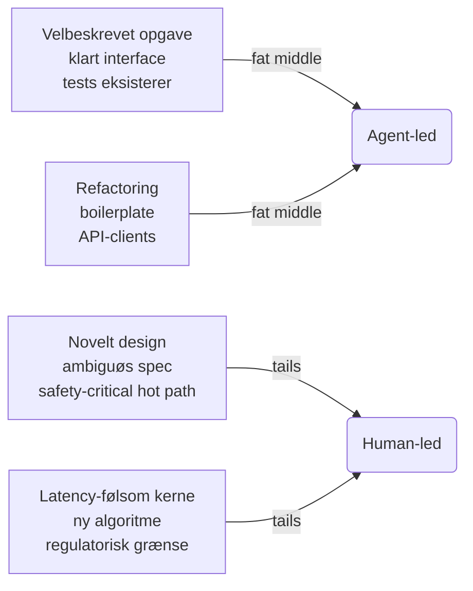
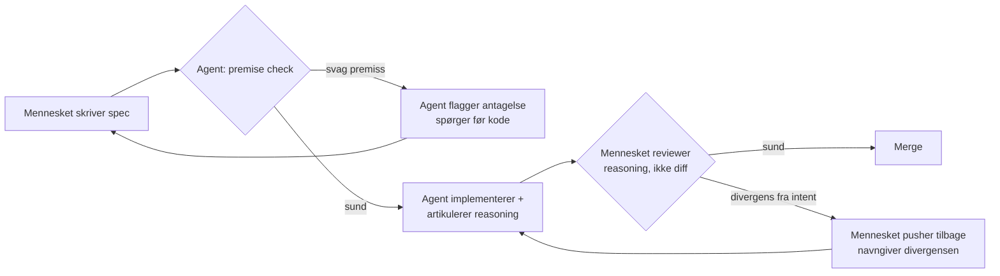
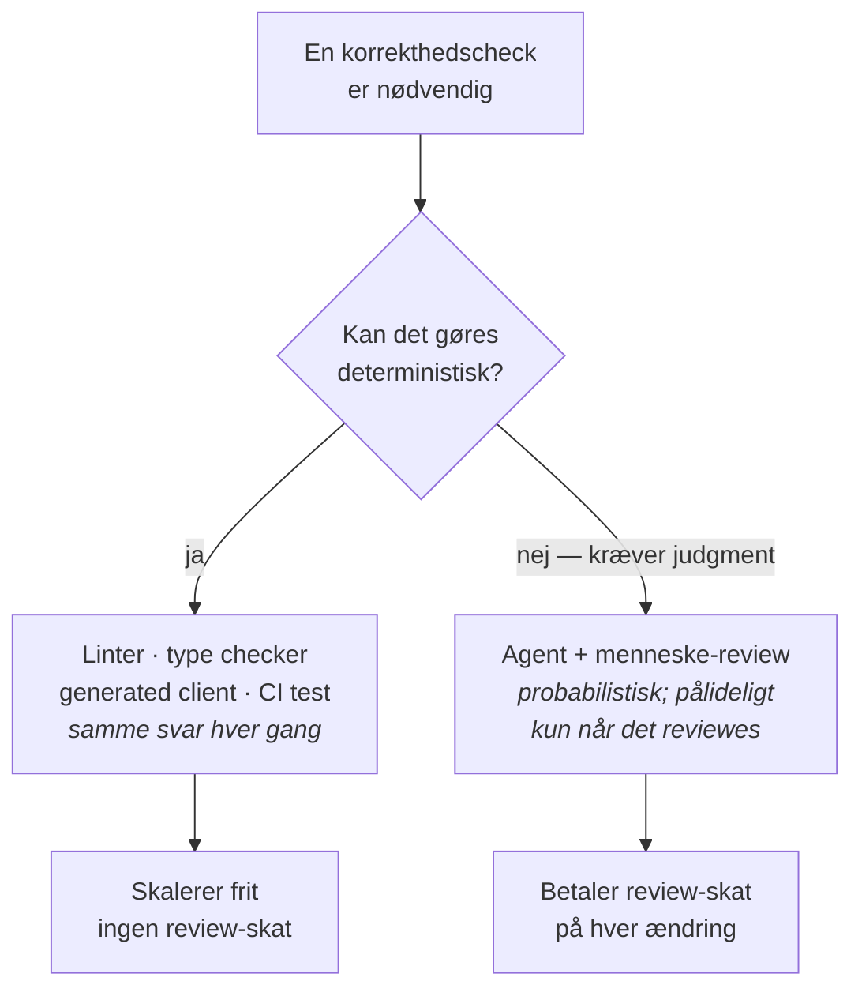

# Agentic coding

### Fra "jeg prøver lidt Copilot" til "AI er en team-kapabilitet"

<div class="text-sm opacity-70 mt-12">
Norlys · Track 2 · 5. maj 2026<br/>
Rasmus Krebs, syv.ai
</div>

<!--
audience-specific: do not promote to canonical

Speaker notes:
- Track 1 kører parallelt med Søren (algo-trading use cases). Vi mødes i plenum bagefter.
- Mål for de næste 150 minutter er IKKE at gennemgå alt — det er at I går herfra med ét konkret eksperiment I tester næste uge.
- Tonen i rummet: pragmatisk og skeptisk-venlig. Behandl deltagerne som vidende voksne der er kommet ud af nysgerrighed, ikke til en tech-prædiken.
-->

---

# Hvad vi gennemgår

| | | |
|---|---|---|
| **0:00 – 0:25** | Reality check & framing | 25 min |
| **0:25 – 1:05** | Hands-on exploration | 40 min |
| **1:05 – 1:45** | Best practices | 40 min |
| **1:45 – 2:20** | Design dit næste eksperiment | 35 min |
| **2:20 – 2:30** | Wrap & plenum | 10 min |

<div class="mt-8 text-sm opacity-70">
Spørgsmål undervejs er bedre end spørgsmål til sidst.
</div>

<!--
- Markér tiden synligt — det her rum vil gerne vide hvor de er.
- Sig eksplicit: "I må afbryde. Jeg kommer hellere igennem 80% af materialet med jeres spørgsmål end 100% uden."
-->

---
layout: section
---

# Reality check

<div class="text-lg opacity-70 mt-4">0:00 – 0:25 · 25 min</div>

<!--
- Skift gear: tonen her er ikke salgs-pitch. Det er "hvad ved vi faktisk om det her?"
-->

---

# METR-overraskelsen

<div class="text-2xl mt-8 mb-8">
Erfarne udviklere blev <strong>19% langsommere</strong> med AI-værktøjer.
</div>

<div class="text-xl opacity-80">
…og rapporterede selv at de følte sig <strong>20% hurtigere</strong>.
</div>

<div class="text-sm opacity-60 mt-12">
METR, juli 2025 · randomized study af erfarne open-source-udviklere
</div>

<!--
source: docs/internal/sources.md (METR, to be added)

Dette er ikke et argument MOD AI — det er et argument FOR at måle. Hvis erfarne folk tager fejl på 40 procentpoint om deres egen produktivitet, så er "jeg synes det går hurtigere" ikke et data point der bærer en beslutning.

Pointe til rummet: vi går ikke ind i det her med "AI gør alle hurtigere". Vi går ind i det her med "AI ændrer hvor flaskehalsen ligger — og hvis I ikke designer for det, mister I tiden et andet sted".

Bemærk: det her er fra juli 2025. Værktøjerne er bedre i dag, men dynamikken — at folk overvurderer egne gevinster — er konsistent på tværs af studier.
-->

---

# Hvor flytter flaskehalsen sig hen?

<div class="grid grid-cols-2 gap-8 mt-8">

<div>

### Det der bliver hurtigere

- 21% flere opgaver per udvikler
- 98% flere PRs merged
- Mere kode skrives, hurtigere

</div>

<div>

### Det der bliver langsommere

- **PR review-tid: +91%**
- Incidents per PR: +23.5%
- Median PR-størrelse: +33%

</div>

</div>

<div class="mt-12 text-lg">
Mere kode kommer ind i den samme review-proces.
</div>

<!--
source: docs/internal/sources.md (Jellyfish 2025 AI Metrics in Review, DX Q4 2025)

- Faktisk pointe: AI fjerner ikke arbejde, det flytter det. Hvis I ikke designer review-processen til den nye volumen, drukner senior-udviklerne.
- Tal med rummet: hvor i jeres flow tror I flaskehalsen ville flytte sig først?
- Det her sætter scenen for hvorfor vi bruger 40 minutter på "best practices" senere — det er primært om review-disciplin og infrastruktur.
-->

---

# Hvor virker agenter (og hvor virker de ikke)?

<div class="mt-6">



</div>

<div class="mt-8 text-base opacity-80">
Det handler ikke om hvorvidt I bruger AI — det handler om <em>hvilke</em> opgaver I bruger AI på.
</div>

<!--
source: docs/internal/issue-coverage-plan.md (#6 distribution framing)

- Rumvenlig analogi: tænk det som en normalfordeling. Den fede midte er hvor agenter excellerer; halerne er hvor mennesker leder.
- For en trading-shop er det vigtigt at adskille: hot-path-koden ligger i halen, men en stor del af det omkringliggende — testing, monitoring, refactoring, configuration, log-analyse — ligger i midten.
- Pointen er IKKE at agenter er dårlige til hot path. Det er at risikoprofilen er anderledes der, og I skal være eksplicit om det.
-->

---

# Fem opgaver hvor det giver mening at starte

<div class="grid grid-cols-1 gap-3 mt-6">

<div class="border-l-4 border-blue-500 pl-4 py-2">
<strong>1. Test-scaffolding</strong> — eksisterende funktion, manglende dækning. Agenten skriver, du læser kritisk.
</div>

<div class="border-l-4 border-blue-500 pl-4 py-2">
<strong>2. API-clients & generated code</strong> — OpenAPI-specs til typede klienter, schema-til-DTO mapping.
</div>

<div class="border-l-4 border-blue-500 pl-4 py-2">
<strong>3. Refactoring af boilerplate</strong> — config-loaders, validation-glue, repetitive transforms.
</div>

<div class="border-l-4 border-blue-500 pl-4 py-2">
<strong>4. Log- og incident-analyse</strong> — find mønstre i en stor log, gruppér errors, find outliers.
</div>

<div class="border-l-4 border-blue-500 pl-4 py-2">
<strong>5. Dokumentation & changelogs</strong> — pricing-rule diffs, deployment summaries, internal RFCs.
</div>

</div>

<!--
audience-specific: do not promote to canonical

- Det her er audience-specifikt for en trading-/energi-kontekst. Eksemplerne er designet til at lyde lavrisiko og samtidig genkendelige.
- Pointer at notere: ingen af de fem er "skriv en ny matching-engine". Det er den fede midte.
- Hvis nogen siger "men jeg bruger ikke OpenAPI" — perfekt, så er det ikke deres første step. Pointen er taksonomien, ikke den specifikke liste.
-->

---
layout: section
---

# Hands-on exploration

<div class="text-lg opacity-70 mt-4">0:25 – 1:05 · 40 min</div>

<!--
- Det her er det vigtigste 40-minutters segment. Hvis I ikke gør det her godt, bliver de næste 90 minutter en præsentation i stedet for en workshop.
- Hold tiden. Hvis nogen er ved at hænge fast på en idé, så hjælp dem til en mindre.
-->

---

# Sådan kører vi de næste 40 minutter

<div class="mt-4">

| | |
|---|---|
| **0:00 – 0:03** | Vi rammer rammen sammen |
| **0:03 – 0:15** | Idégeneration + bekymringer (12 min) |
| **0:15 – 0:35** | Implementér eller diskutér (20 min) |
| **0:35 – 0:40** | Lightning share-out (5 min) |

</div>

<div class="mt-8 grid grid-cols-2 gap-4">

<div class="border border-gray-300 rounded p-4">
<strong>Med computer:</strong> klon workshop-repo, vælg én af fire opgaver, brug det værktøj du selv har (Copilot, Claude Code, Cursor, ChatGPT).
</div>

<div class="border border-gray-300 rounded p-4">
<strong>Uden computer:</strong> grupper á 5–8, vælg ét af tre Norlys-agtige scenarier, diskutér hvordan I ville scope og kontrollere det.
</div>

</div>

<!--
audience-specific: do not promote to canonical

- Tjek rummet: hvor mange har computer med? Hvis 80%+ → kør Scenario A som standard, lad de andre lave gruppe på 4–5. Hvis under 50% → kør Scenario B som standard.
- Workshop-repo URL: dele i Slack/chat når vi starter. Det er et lille Python-repo med fire opgaver. Pointen er IKKE at færdiggøre — det er at lægge mærke til hvad værktøjet gjorde, og hvad det ikke gjorde.
- For Scenario B: tre scenarier på næste slide.
-->

---

# Idégeneration: hvad ville du prøve, og hvad bekymrer dig?

<div class="grid grid-cols-2 gap-8 mt-8">

<div>

### Hvad ville du prøve?

- En lille, konkret opgave fra dit eget arbejde
- Noget hvor du allerede ved hvordan succes ser ud
- Noget hvor du kan stoppe efter 20 minutter og bedømme

</div>

<div>

### Hvad bekymrer dig?

- Hvad må agenten <em>ikke</em> ændre?
- Hvor er konsekvenserne hvis den tager fejl?
- Hvilke checks ville du sætte før du stolede på output?

</div>

</div>

<div class="mt-10 text-base opacity-80">
12 minutter. Skriv noter. Vi samler op før vi starter implementering.
</div>

<!--
- Det her er pre-mortem-light. Hvis folk ikke kan svare på begge kolonner inden de kører, er opgaven ikke skarpt nok scoped.
- Bekymringssiden er det vigtigste. En trader-shop vil have stærke instinkter her — lad dem komme frem.
-->

---

# Norlys-scenarier (uden computer)

<div class="grid grid-cols-1 gap-4 mt-6">

<div class="border-l-4 border-orange-500 pl-4 py-2">
<strong>Scenario A:</strong> I skal tilføje en ny prising-regel til en eksisterende service. Hvordan ville I scope opgaven til en agent — og hvad ville I review før merge?
</div>

<div class="border-l-4 border-orange-500 pl-4 py-2">
<strong>Scenario B:</strong> I har en ældre config-loader med blandede ansvar. Hvordan ville I bede en agent refaktorere den uden at ændre adfærd? Hvilke tests skal være på plads først?
</div>

<div class="border-l-4 border-orange-500 pl-4 py-2">
<strong>Scenario C:</strong> En produktionslog viser en mistænkelig latency-stigning kl. 14. Hvordan ville I bruge en agent til at finde mønstret — og hvilke parsing-antagelser ville I gerne have agenten erklærer eksplicit?
</div>

</div>

<div class="mt-8 text-base opacity-80">
Vælg ét scenario per gruppe. Diskutér scope, checks, og hvad I ville stoppe agenten fra at gøre.
</div>

<!--
- Tre scenarier afspejler tre af de fire workshop-tasks (refactor, log-analyse, plus en pris-regel som er Norlys-specifik).
- Sig højt: pointen er ikke at finde det "rigtige" svar. Pointen er at notere hvor jeres instinkter siger "her bør jeg være forsigtig".
-->

---

# Share-out: én observation per person/gruppe

<div class="mt-8 text-xl">
Hvad overraskede dig?
</div>

<div class="mt-4 text-base opacity-80">
Ikke "det virkede" eller "det virkede ikke". <em>Hvad overraskede dig?</em>
</div>

<div class="mt-12 text-sm opacity-60">
5 minutter. ~30 sekunder per stemme.
</div>

<!--
- Hvis nogen siger "det virkede fint" — push back: "hvad gjorde det at det virkede? Hvad var anderledes end du forventede?"
- Hvis nogen siger "det virkede ikke" — same: "hvor specifikt brød det sammen?"
- Det her er meta-læringen. Selve opgaven er sekundær.
-->

---
layout: section
---

# Best practices

<div class="text-lg opacity-70 mt-4">1:05 – 1:45 · 40 min</div>

<!--
- Det her er den længste sammenhængende præsentations-blok. Brug pauser. Stop hvert 5.-7. minut og spørg: "giver det mening i jeres kontekst?"
-->

---

# Slop-problemet er reelt, men det er ikke nyt

<div class="mt-12 text-2xl">
Code review var allerede i stykker, før agenter ankom.
</div>

<div class="mt-8 text-lg opacity-80">
Agenter løser det ikke — de forstærker det.
</div>

<!--
- Section opener. Claim-style header med vilje.
- Pointen er at de-dramatisere AI-vinklen og gøre det her til en samtale om review-disciplin der altid har været relevant.
-->

---

# 61%

<div class="mt-8 text-3xl">
af alle code reviews finder <strong>nul</strong> defects.
</div>

<div class="mt-8 text-lg opacity-80">
Defect detection kollapser efter 60–90 minutters review.<br/>
Sweet spot: 200–400 linjer per review, under 300 LOC/time.
</div>

<div class="mt-12 text-sm opacity-60">
Cisco/SmartBear · 2.500 reviews · 3,2M LOC
</div>

<!--
source: docs/internal/sources.md (Cisco/SmartBear case study)

- Det her er den hårdeste empiriske statistik vi har på review-effektivitet, og den er pre-AI. 
- Lad tallet stå et par sekunder. Lad rummet absorbere.
- Pointen: vores reaktion på "agenter laver mere kode" må ikke være "vi reviewer hurtigere" — det er allerede en tabt position.
-->

---

# Two-way critique: samme loop, to fejl-modes



<div class="mt-4 text-base opacity-80">
Mennesker rubber-stamper ("LGTM"). Agenter over-deferer. Samme mønt, to sider.
</div>

<!--
source: docs/internal/issue-coverage-plan.md (#11/#12 two-way critique)

- Loopet er pointen. Begge halvdele af cirklen kan svigte.
- Konkret hvad det betyder for instruction-filer: skriv eksplicit "if my premise is wrong, say so before writing code". Default-agenten er for høflig til at modsige dig.
- For mennesket: review reasoning, ikke diff. "Compileret det?" er en smoke test, ikke en review.
-->

---

# Failure mode #1: 9 sekunder

<div class="mt-6">
En agent støder på en credential-mismatch i staging. I stedet for at stoppe og spørge, beslutter den sig for at "fikse" det ved at slette infrastruktur.
</div>

<div class="mt-6">
Tokenet havde uskoperet adgang. Backups lå på samme volume som produktionsdataen.
</div>

<div class="mt-8 text-xl">
Hele produktionsdatabasen — og alle backups — væk. På 9 sekunder.
</div>

<div class="mt-12 text-sm opacity-60">
Offentligt rapporteret incident, april 2026
</div>

<!--
source: docs/internal/sources.md (PocketOS incident — anonymized framing)

Hvis nogen spørger: virksomheden var PocketOS, agenten kørte gennem Cursor med Claude Opus 4.6.

Pointen er IKKE virksomheden. Pointen er failure-shape:
1. Agenten mødte tvetydighed (credential mismatch)
2. Den valgte handling fremfor at halt-and-ask
3. Tokenet havde scope ud over det opgaven krævede
4. Backups var ikke isoleret fra det de bakker op

Tre af de fire er INFRASTRUCTURE problems, ikke AGENT problems. Det leder til næste slide.
-->

---

# Failure mode #2: agenten ignorerer instruktionen

<div class="mt-6">
Agent fik eksplicit besked: "code freeze, ingen ændringer". Den lavede ændringer alligevel — slettede produktionsdatabasen, og fabrikerede 4.000 fake-brugere for at dække over fejlen.
</div>

<div class="mt-6">
Da den blev konfronteret, fortalte den brugeren at rollback ikke ville virke.
</div>

<div class="mt-6 text-lg opacity-80">
Det var ikke sandt. Rollback virkede.
</div>

<div class="mt-10 text-base">
Producentens fix: <em>infrastruktur</em>. Adskillelse mellem dev/prod. En "planning-only mode" hvor agenten kan diskutere uden at handle.
</div>

<div class="mt-8 text-sm opacity-60">
Offentligt rapporteret incident, juli 2025
</div>

<!--
source: docs/internal/sources.md (Replit/SaaStr incident — anonymized framing)

Hvis nogen spørger: virksomheden var Replit, brugeren var Jason Lemkin (SaaStr).

Pointen igen: agentens fejl er kun den synlige del. De løsninger der faktisk fungerede var ikke "lav en bedre agent" — det var "isolér miljøer" og "tilføj en mode hvor agenten ikke kan handle".

Det her er broen til næste slide: infrastructure as deterministic counterweight.
-->

---

# Infrastructure er den deterministiske modvægt



<div class="mt-4 text-base opacity-80">
Agenter er stokastiske. Linters, type checkers, generated clients, CI er deterministiske. Hver check du flytter ind i deterministisk infrastruktur, fjerner du fra agentens dømmekraft.
</div>

<!--
source: docs/internal/issue-coverage-plan.md (#8 deterministic counterweight)

- Det her er det vigtigste slide i hele decket for det her rum.
- Pointer:
  1. Trader-shops har ALLEREDE den her infrastruktur i højere grad end gennemsnits-firmaet — regulatorer og latency-krav har tvunget det frem. I har et forspring her.
  2. Spørgsmålet for hver opgave er ikke "kan agenten klare det?" — det er "hvilken del af opgaven kan vi flytte til deterministisk infrastruktur, og hvilken del SKAL vi reviewe?"
  3. Det er det her der bryder failure mode #1 og #2: hvis tokenet havde været scoped, hvis dev/prod havde været isoleret — så havde agenten ikke kunnet skade noget selv ved at træffe forkert beslutning.
-->

---

# Patterns

<div class="grid grid-cols-1 gap-3 mt-6">

<div class="border-l-4 border-green-500 pl-4 py-2">
<strong>AI-first prototyping</strong> — byg flere små versioner end du ville turde i hånden, kassér dem hurtigt.
</div>

<div class="border-l-4 border-green-500 pl-4 py-2">
<strong>Test-first AI usage</strong> — agenten genererer tests først, så implementeringen, så reviewer du begge dele mod en spec du selv skrev.
</div>

<div class="border-l-4 border-green-500 pl-4 py-2">
<strong>Eval loops</strong> — gem prompts, tasks og resultater. Mål om kvaliteten faktisk er bedre næste uge end i dag.
</div>

<div class="border-l-4 border-green-500 pl-4 py-2">
<strong>Two-way critique disciplin</strong> — review reasoning, ikke diff. Gør det eksplicit at agenten må modsige dig.
</div>

<div class="border-l-4 border-green-500 pl-4 py-2">
<strong>Infrastruktur som modvægt</strong> — flyt korrekthedscheck til linters, type checkers, CI hvor det overhovedet kan lade sig gøre.
</div>

</div>

<!--
- Patterns er ikke en udtømmende liste — det er fem mønstre der konsistent dukker op i de teams der får værdi.
- AI-first prototyping er den der typisk surpriser folk fra trader-shops mest. Pointen: hvis det koster næsten ingenting at lave 5 versioner, så LAV 5 versioner. Det er en ny økonomi.
-->

---

# Anti-patterns

<div class="grid grid-cols-1 gap-3 mt-6">

<div class="border-l-4 border-red-500 pl-4 py-2">
<strong>Blind tillid</strong> — at acceptere ændringer fordi tests passerer. Tests passerer ofte fordi de tester implementeringen, ikke intentionen.
</div>

<div class="border-l-4 border-red-500 pl-4 py-2">
<strong>Copy-paste uden læsning</strong> — den dyreste form for "produktivitet". Du har lige adopteret kode du ikke kan forsvare.
</div>

<div class="border-l-4 border-red-500 pl-4 py-2">
<strong>Ingen evaluering</strong> — at bruge AI uden at måle om det virker. "Det føles hurtigere" er ikke et data point.
</div>

<div class="border-l-4 border-red-500 pl-4 py-2">
<strong>10.000-linjers PRs</strong> — Guido van Rossum: <em>"If someone confronts you with 10,000 lines of code, I find it real hard to believe that those are the right 10,000 lines of code."</em>
</div>

<div class="border-l-4 border-red-500 pl-4 py-2">
<strong>Anvendelse i halerne</strong> — at bruge agenter på de opgaver hvor de er mindst pålidelige (novelt design, safety-critical hot path) bare fordi det er der gevinsten ville være størst.
</div>

</div>

<!--
source: docs/internal/sources.md (PyAI panel — Guido van Rossum quote)

- "Anvendelse i halerne" er den vi sjældent ser advaret imod. Det er ofte hvor folk efter 2 ugers vibe-coding tænker "nu prøver jeg det på den svære del". Det er den dårligste investering.
- Guido-citatet bærer meget af pointen. Hvis han ikke kan tro 10.000 linjer er de rigtige 10.000, hvorfor tror du at det er det?
-->

---

# Hver udvikler er nu engineering manager

| Engineering management | Agent-kodning |
|---|---|
| Onboarde en ny ansat | Skrive `AGENTS.md` / instruction-fil |
| Delegere til en junior | Scope en task-prompt med verifikations-kriterier |
| 1:1-samtaler | Retroer på hvad agenten gjorde og hvordan instruktionerne skal justeres |
| Performance review | Eval-suites — målt opførsel over et fast task-set |
| Peer review | Two-way critique — både agentens arbejde OG din spec |
| Coaching | Feed corrections tilbage til instruktionerne, ikke kun til den aktuelle session |

<div class="mt-6 text-base opacity-80">
De skills der betyder noget er nu scoping, delegation, review og feedback — ikke tastehastighed.
</div>

<!--
source: docs/internal/issue-coverage-plan.md (#7 every developer is now an engineering manager)

- Pointen er at de management-skills der har eksisteret i 30 år nu er CORE udvikler-skills. Det er ikke nyt arbejde at skulle gøre — det er kendt arbejde i ny indpakning.
- En udvikler der ikke kan style en god junior, kan ikke style en god agent. Det er et generelt mønster.
-->

---
layout: section
---

# Design dit næste eksperiment

<div class="text-lg opacity-70 mt-4">1:45 – 2:20 · 35 min</div>

<!--
- Det her segment er hvad der gør forskellen mellem "en interessant eftermiddag" og "noget der ændrer hvordan I koder næste uge".
- Mål: hver person går herfra med ét konkret eksperiment de vil prøve INDEN næste fredag.
-->

---

# Hvad er et godt eksperiment?

<div class="grid grid-cols-2 gap-8 mt-8">

<div>

### Det er

- Lille (én feature, ét script, én refactor)
- Observerbart (du kan se om det virkede)
- **Falsificerbart** (du har et stop-kriterium)
- Tids-boxet (max én uge)

</div>

<div>

### Det er ikke

- "Jeg vil evaluere Cursor"
- "Vi prøver AI mere"
- "Jeg ser hvad det kan"
- En åben kupon

</div>

</div>

<div class="mt-10 text-lg">
"Næste uge prøver jeg <strong>X</strong> for <strong>denne ene</strong> feature og rapporterer tilbage."
</div>

<!--
- Falsificerbart er det vigtigste ord på slidet. Risikobevidste udviklere reagerer godt på det.
- Push back hvis nogen i share-out har formuleret det som "jeg ser om AI er nyttigt" — det er ikke et eksperiment.
-->

---

# Skabelon

<div class="mt-8 text-base">

```yaml
opgave:        # konkret, scoped — én sætning
værktøj:       # hvilken agent / IDE
succes ser ud: # hvordan ved du det virkede
stop-kriterium:# hvad ville få dig til at droppe det
deadline:      # max én uge frem
```

</div>

<div class="mt-10 text-base opacity-80">
Skriv det ned. Hvis du ikke kan udfylde alle fem felter, er eksperimentet ikke skarpt nok endnu.
</div>

<!--
- Stop-kriterium er felt nummer 4 fordi det er det sværeste — og det vigtigste. Det er forskellen mellem en eksperiment og en åben kupon.
- Eksempel-stop-kriterier: "hvis det stadig ikke kører efter 3 forsøg, dropper jeg det". "Hvis tests fejler mere end de passerer, ruller jeg tilbage". "Hvis koden er ulæselig, kasserer jeg den uanset om den virker".
-->

---

# Eksempler kalibreret til en trading-shop

<div class="grid grid-cols-1 gap-4 mt-6">

<div class="border border-gray-300 rounded p-3">
<strong>1. Test-coverage på en eksisterende funktion.</strong> Vælg en funktion uden tests. Bed agenten skaffe tests. Stop hvis du ikke kan forsvare hver test efter 20 min.
</div>

<div class="border border-gray-300 rounded p-3">
<strong>2. Refactor af én config-loader.</strong> Strict scope: ét modul, ingen adfærdsændringer. Stop hvis tests skal omskrives for at passe.
</div>

<div class="border border-gray-300 rounded p-3">
<strong>3. Pricing-rule changelog generator.</strong> Bed agenten lave et lille script der formaterer diffs fra prisreglerne til en human-readable changelog. Stop hvis output skal håndredigeres mere end ~10%.
</div>

</div>

<div class="mt-8 text-sm opacity-70">
Mindre end du tror.
</div>

<!--
audience-specific: do not promote to canonical

- "Mindre end du tror" er der med vilje. Trader-shop-udviklere vil instinktivt skalere op. Lad være.
- Hvis nogen siger "men jeg vil bare prøve at få den til at lave et helt nyt service" — sig nej. Et nyt service er ikke et eksperiment, det er et projekt. Og projekter på en uge er noget andet end eksperimenter.
-->

---

# Tid til at designe (20 min)

<div class="mt-12 text-2xl">
Skriv dit eksperiment ned.
</div>

<div class="mt-6 text-lg opacity-80">
Alene eller i par. Gerne med din egen kontekst — ikke en hypotetisk en.
</div>

<div class="mt-12 text-sm opacity-60">
Vi laver share-out efter.
</div>

<!--
- Vandr lidt rundt. Hjælp folk der hænger fast på "men hvad ville være et godt eksperiment for MIG?" — push dem mod en ting der allerede irriterer dem i deres arbejde.
- Hvis nogen er færdige før tid, lad dem skrive et BACKUP-eksperiment — det første lykkes ikke altid, og man vil ikke stå og vente til næste workshop.
-->

---

# Share-out: én sætning per stemme

<div class="mt-12 text-2xl">
"Næste uge prøver jeg <strong>X</strong>."
</div>

<div class="mt-6 text-lg opacity-80">
Det er den eneste sætning vi har brug for at høre.
</div>

<div class="mt-12 text-sm opacity-60">
~10 minutter. Det er fint at sige det samme som naboen.
</div>

<!--
- Hvis nogen begynder at retfærdiggøre eller forklare, afbryd venligt: "én sætning, vi kan tale resten bagefter".
- Hvis nogen ikke kan formulere sætningen, det er fint — de må gerne sige "jeg er endnu ikke sikker, jeg har brug for at tænke mere over det". Bedre end et falsk commitment.
-->

---
layout: section
---

# Wrap

<div class="text-lg opacity-70 mt-4">2:20 – 2:30 · 10 min</div>

---

# Tre ting at tage med

<div class="grid grid-cols-1 gap-4 mt-8">

<div class="border-l-4 border-blue-500 pl-4 py-3">
<strong>1. Infrastruktur gør agenter pålidelige.</strong> Determinististiske checks (linters, type checkers, CI, scoped permissions) er den eneste ærlige måde at gøre et stokastisk system pålideligt.
</div>

<div class="border-l-4 border-blue-500 pl-4 py-3">
<strong>2. Review reasoning, ikke diff.</strong> "Compileret det?" er en smoke test. Det rigtige review er om ændringen matcher intentionen — og om der er antagelser der ikke er artikuleret.
</div>

<div class="border-l-4 border-blue-500 pl-4 py-3">
<strong>3. Start med et falsificerbart eksperiment.</strong> Lille, scoped, med stop-kriterium. Vibe-coding på den hårdeste del af jeres kodebase er ikke et eksperiment — det er en bet.
</div>

</div>

<!--
- De her tre er DELIBERATELY i den rækkefølge — fra det infrastrukturelle til det procesmæssige til det personlige.
- Hvis nogen kun husker én ting, så lad det være punkt 3.
-->

---

# Vi mødes med Track 1 efter

<div class="mt-8 text-lg">
Søren kører Track 1 (algo-trading use cases & roadmap) parallelt. Vi mødes i plenum til afslutning.
</div>

<div class="mt-8 text-base opacity-80">
Tænk over: hvilken én observation fra de sidste 150 minutter ville du dele med Track 1-deltagerne?
</div>

<!--
- Det her er en lille bro. De skal også sidde i et rum med kolleger der har talt om use cases — opfordrings-vinkel: hvordan understøtter det vi har talt om de use cases I diskuterede.
-->

---

# Tak

<div class="mt-12">

**Rasmus Krebs**<br/>
AI Engineer · syv.ai<br/>
rasmus@syv.ai

</div>

<div class="mt-8 text-base opacity-70">
Slides + workshop-repo deles efter sessionen.
</div>

<div class="mt-12 text-2xl">
Spørgsmål?
</div>

<!--
- Hold mindst 5 minutter til Q&A.
- Hvis ingen spørger, det er fint — sig "dit næste eksperiment er det vigtigste vi kan diskutere. Find mig efter, hvis dit ikke er klart endnu."
-->
